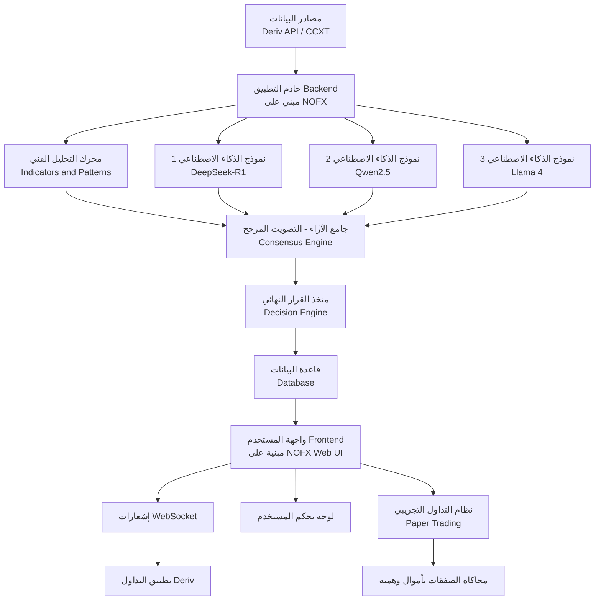
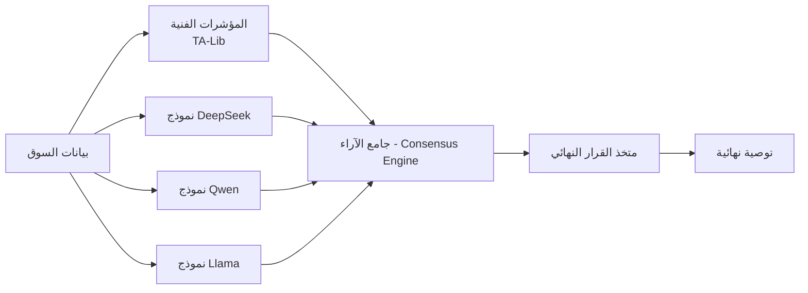
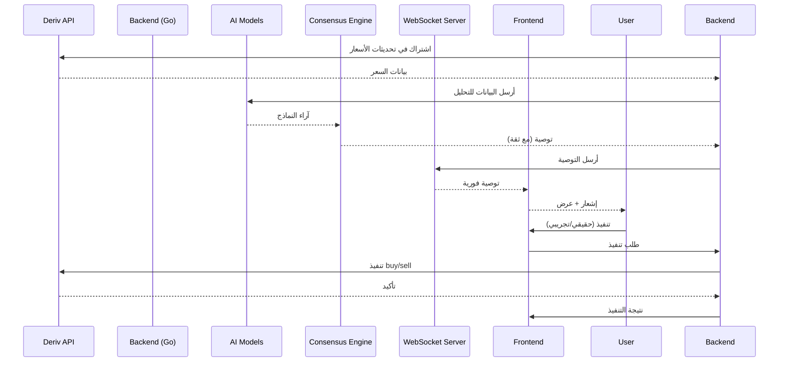

📘 الدليل الشامل لبناء نظام تداول ذكي متكامل مع Deriv API

الإصدار: 2.0 | التاريخ: 2026-03-14
الهدف: توثيق كامل ومفصل لبناء موقع ويب متكامل يحلل الأسواق المالية باستخدام الذكاء الاصطناعي ويقدم توصيات تداول (صفقات صعود/هبوط) تعتمد على بيانات حقيقية من منصة Deriv، مع إمكانية تنفيذ الصفقات آلياً أو يدوياً، بالإضافة إلى نظام تداول تجريبي متكامل للاختبار الآمن. يعتمد هذا الدليل على أحدث المشاريع مفتوحة المصدر ذات التجارب الفعلية والمجتمعات النشطة.

---

📑 جدول المحتويات

1. نظرة عامة على المشروع
2. المكونات الأساسية للنظام
3. الأدوات والمستودعات مفتوحة المصدر المستخدمة (محدث 2026)
   · 3.1 CCXT
   · 3.2 NOFX - النواة الرئيسية للمشروع (Agentic Trading OS)
   · 3.3 نماذج الذكاء الاصطناعي (LLMs) للتكامل
   · 3.4 OKX Agent Kit
   · 3.5 Deriv API
4. البنية التحتية للمشروع
5. المرحلة 1: إعداد الحسابات والحصول على مفاتيح API
6. المرحلة 2: إعداد بيئة التطوير
7. المرحلة 3: بناء طبقة الاتصال بمنصة Deriv
8. المرحلة 4: دمج CCXT لجلب بيانات متعددة المصادر
9. المرحلة 5: بناء محرك التحليل الفني والذكاء الاصطناعي
   · 5.1 دمج NOFX كنواة للمشروع
   · 5.2 دمج نماذج LLM المتعددة
   · 5.3 دمج OKX Agent Kit
   · 5.4 آلية "الدراسة الجماعية" والتصويت المرجح (Multi-Model Consensus)
   · 5.5 متخذ القرار النهائي
10. المرحلة 6: تطوير واجهة الويب
11. المرحلة 7: ربط النظام وإرسال الإشعارات
12. المرحلة 8: الاختبار والنشر
13. المرحلة 9: إدارة المخاطر والأمان
14. المرحلة 10: نظام التداول التجريبي (Paper Trading)
15. المراجع والمستودعات الموثوقة
16. الملاحق

---

1. نظرة عامة على المشروع

🎯 الرؤية

بناء منصة ويب ذكية (Dashboard) تعمل على مدار الساعة تقوم بتحليل الأسواق المالية باستخدام خوارزميات الذكاء الاصطناعي وتقديم توصيات تداول دقيقة (صفقات صعود/هبوط) بناءً على بيانات حقيقية من منصة Deriv، مع إمكانية تنفيذ الصفقات آلياً عبر API أو إرسال إشعارات للمستخدم لتنفيذها يدوياً. كما يتضمن النظام بيئة تداول تجريبية كاملة (Paper Trading) لاختبار الاستراتيجيات والتوصيات بدون مخاطرة مالية.

📊 آلية العمل

1. جلب البيانات من Deriv API و/أو منصات أخرى عبر CCXT.
2. تحليل البيانات باستخدام المؤشرات الفنية وأنماط الشموع.
3. تطبيق نماذج الذكاء الاصطناعي المتعددة (DeepSeek, Qwen, Llama, إلخ) بالتوازي باستخدام بنية NOFX.
4. مرحلة "الدراسة الجماعية" حيث تتناقش النماذج وتصوت على التوصية الأفضل مع تحديث الأوزان بناءً على الأداء التاريخي.
5. توليد توصية نهائية تتضمن: نوع الصفقة (Call/Put)، وقت الانتهاء، ونسبة موثوقية محسوبة بدقة.
6. إرسال التوصية إلى واجهة المستخدم عبر WebSocket، مع إشعار فوري.
7. تنفيذ الصفقة (يدوياً من المستخدم، آلياً إذا كان مفعلاً، أو تجريبياً في وضع الاختبار).

---

2. المكونات الأساسية للنظام



شرح المكونات الموسع:

· مصادر البيانات: Deriv API (رسمي) و CCXT (للبورصات الأخرى).
· الخادم: مبني على بنية NOFX (Go + React) مع دعم WebSocket .
· محرك التحليل الفني: مكتبات مخصصة لحساب RSI, MACD, Bollinger Bands باستخدام TA-Lib .
· نماذج الذكاء الاصطناعي المتعددة: DeepSeek, Qwen, Llama تعمل بالتوازي في وضع المنافسة .
· جامع الآراء (Consensus Engine): يجمع مخرجات النماذج المختلفة ويطبق نظام التصويت المرجح مع تحديث الأوزان بناءً على الأداء.
· متخذ القرار النهائي: يدمج نتائج التحليل الفني والتصويت لإصدار توصية نهائية.
· قاعدة البيانات: PostgreSQL لتخزين المستخدمين والصفقات والسجلات.
· واجهة المستخدم: مستوحاة من واجهة NOFX الاحترافية (React + TailwindCSS) .
· الإشعارات: WebSocket لإرسال التوصيات فور توليدها.
· التنفيذ الآلي: ربط مباشر مع Deriv API عبر WebSocket.
· نظام التداول التجريبي: يحاكي السوق الحقيقي بأموال وهمية ويستخدم نفس البيانات الحية.

---

3. الأدوات والمستودعات مفتوحة المصدر المستخدمة (محدث 2026)

3.1 CCXT

الرابط: https://github.com/ccxt/ccxt

التجربة العملية: مكتبة مستقرة منذ 2017، تُستخدم في آلاف المشاريع التجارية ومفتوحة المصدر. تدعم أكثر من 100 منصة تداول وتعتبر المعيار الفعلي للتعامل مع بورصات العملات الرقمية .

الوصف: مكتبة برمجية مفتوحة المصدر تدعم أكثر من 100 منصة تداول للعملات الرقمية (بما فيها Binance, Bybit, OKX). توفر واجهة موحدة لجلب بيانات السوق (الأسعار، الشموع، حجم التداول) وتنفيذ الصفقات.

دورها في المشروع:

· جلب بيانات تاريخية وحالية من منصات متعددة لتعزيز دقة التحليل.
· توفير بيانات احتياطية في حال تعطل Deriv API.
· إمكانية توسيع النظام ليشمل أصولاً من بورصات أخرى.

اللغات المدعومة: JavaScript, Python, PHP, C#, Go, Ruby, Swift, Kotlin.

3.2 NOFX - النواة الرئيسية للمشروع (Agentic Trading OS)

الرابط: https://github.com/zengfield/nofx-dex 

التجربة العملية: مشروع حقق أكثر من 9000 نجمة على GitHub في شهرين فقط (أكتوبر-ديسمبر 2025) . تم اختباره عملياً مع Binance و Hyperliquid و Aster DEX، ويثبت يومياً قدرته على تشغيل نماذج AI متعددة في منافسة حية . ورغم بعض الثغرات الأمنية المبكرة التي تم تداركها ، إلا أنه يظل أقوى وأشهر مشروع مفتوح المصدر في مجال "AI Trading Arena".

الوصف: نظام تشغيل تداول وكيل (Agentic Trading OS) متكامل مبني بلغة Go مع واجهة أمامية React. يدعم:

· منافسة متعددة النماذج (Multi-AI Competition): تشغيل DeepSeek و Qwen و Claude في معركة تداول حية مع لوحة متصدرين فورية .
· التعلم الذاتي (Self-Learning): يحلل آخر 20 دورة تداول ويتجنب تكرار الأخطاء ويعزز الاستراتيجيات الناجحة .
· دعم بورصات متعددة: Binance, Hyperliquid, Aster DEX، مع إمكانية إضافة بورصات أخرى عبر CCXT .
· واجهة احترافية: رسوم بيانية للأداء، مقارنة فورية بين النماذج، وسجل قرارات مفصل .

دورها في المشروع:

· استخدام بنيتها التحتية كنواة رئيسية للنظام (توفير 70% من وقت التطوير).
· الاستفادة من آلية "منافسة الذكاء الاصطناعي" المدمجة كأساس لـ "الدراسة الجماعية".
· استخدام واجهة المستخدم الجاهزة (React) مع تعديلها لتناسب Deriv API.
· الاستفادة من نظام تسجيل القرارات (Decision Logs) لتحليل الأداء وتحسين النماذج.

ملاحظات أمنية مهمة (من تجارب سابقة):

· يجب تغيير JWT secret الافتراضي فور التثبيت .
· تعطيل "admin mode" الافتراضي .
· استخدام IP whitelisting لمفاتيح API .

3.3 نماذج الذكاء الاصطناعي (LLMs) للتكامل

بناءً على تحليل شامل من MAS Markets (نوفمبر 2025) ، هذه هي أفضل الخيارات المتاحة مع تقييم دقيق لكل منها:

أ. DeepSeek (R1, V3)

الرابط: https://github.com/deepseek-ai

التجربة العملية: النموذج الأكثر استخداماً في مشاريع التداول المفتوحة المصدر (مثل NOFX) . يتميز بأداء قوي وتكلفة منخفضة.

المميزات:

· أداء تنافسي مقابل النماذج الحدودية بتكلفة أقل .
· مجتمع كبير ووثائق غنية.
· دعم رائع في آسيا وانتشار واسع.

التحذيرات: أصدرت بعض الدول (مثل التشيك وعدة ولايات أمريكية) تحذيرات أمنية بشأن استخدام خدماته السحابية، مشيرة إلى احتمالية مشاركة البيانات مع الحكومة الصينية . الحل الآمن: التشغيل المحلي (self-hosting) يتجنب هذه المشكلة.

الأفضل لـ: أدوات داخلية حساسة من حيث التكلفة بعد تقييم المخاطر السيادية.

ب. Llama 4 (Meta)

الرابط: https://github.com/meta-llama

التجربة العملية: النموذج المفتوح الأكثر شيوعاً للمؤسسات. يستخدم في آلاف المشاريع ويتيح نشراً محلياً آمناً تماماً .

المميزات:

· نشر محلي كامل (on-prem) بدون إرسال بيانات لخارج المؤسسة.
· مجتمع ضخم وأدوات دعم واسعة.
· مثالي للتحكم الكامل والخصوصية.

الأفضل لـ: فرق التطوير التي تريد سيادة كاملة على بياناتها.

ج. Qwen (Alibaba)

الرابط: https://github.com/QwenLM

التجربة العملية: مستخدم بشكل أساسي في NOFX إلى جانب DeepSeek . أثبت كفاءة عالية في الأسواق الآسيوية.

المميزات:

· قدرة متعددة اللغات قوية (خاصة الصينية والإنجليزية).
· أحجام نماذج متعددة تناسب مختلف الإمكانيات.
· أداء ممتاز في التحليل الفني.

الأفضل لـ: فرق العمل ذات البعد الآسيوي والتطبيقات منخفضة التكلفة.

د. Mistral (Mixtral, Mistral Large)

الرابط: https://github.com/mistralai

التجربة العملية: نماذج Mixture-of-Experts تقدم أداءً يفوق حجمها، وتستخدم في العديد من المشاريع الأوروبية.

المميزات:

· كفاءة عالية (Mixtral 8x7B يقدم أداء ممتاز بموارد أقل).
· نشر محلي ومؤسسي.
· مناسب للمساعدين الداخليين و coding copilots.

الأفضل لـ: التطبيقات الحساسة للزمن والموارد.

هـ. OpenAI (GPT-5, o-series)

الرابط: https://platform.openai.com

التجربة العملية: الأفضل في البرمجة والتفكير متعدد الخطوات .

المميزات:

· قدرة فائقة على كتابة الأكواد وتصحيحها.
· نماذج "o-series" مخصصة للاستدلال واستخدام الأدوات.
· نظام بيئي متكامل من الإضافات.

الأفضل لـ: النمذجة السريعة للاستراتيجيات (prototyping) ومساعدي البحث.

و. Claude (Anthropic)

الرابط: https://www.anthropic.com

التجربة العملية: مفضل لدى المؤسسات المالية للوثائق والتحليل طويل السياق.

المميزات:

· قدرة فائقة على التعامل مع السياقات الطويلة.
· نبرة متوافقة مع الحوكمة والامتثال.
· ممتاز لكتابة السياسات والتقارير.

الأفضل لـ: توثيق النماذج، تحليل التقارير الطويلة، صياغة سياسات المخاطر.

ز. Gemini (Google DeepMind)

الرابط: https://deepmind.google/technologies/gemini

التجربة العملية: قوي جداً في تحليل المدخلات المتعددة (نصوص، صور، جداول).

المميزات:

· متعدد الوسائط (multimodal).
· نافذة سياق كبيرة جداً.
· ممتاز لقراءة ملفات PDF المعقدة وتحليل الخطب الاقتصادية.

الأفضل لـ: تحليل وثائق البنوك المركزية، التقارير الاقتصادية.

3.4 OKX Agent Kit

الرابط: https://www.okx.com/help/mcp-agent-kit

الوصف: مجموعة أدوات مفتوحة المصدر من OKX تضم 83 أداة جاهزة تغطي:

· تحليل السوق (Market Analysis)
· تنفيذ الاستراتيجيات (Strategy Execution)
· إدارة المحافظ (Portfolio Management)
· مراقبة الأداء (Performance Monitoring)
· أدوات محاكاة (Simulation Tools)

التجربة العملية: تم إصدارها مارس 2026 وهي مبنية على خبرة OKX في التعامل مع ملايين المستخدمين. يمكن استخدام أدوات التحليل الجاهزة لتسريع التطوير بشكل كبير.

دورها في المشروع:

· استخدام أدوات التحليل الجاهزة لتسريع تطوير محرك الذكاء الاصطناعي.
· دعم وضع المحاكاة لاختبار الاستراتيجيات بأمان.
· التكامل مع OKX API (ويمكن تعديله للعمل مع Deriv).

3.5 Deriv API

الرابط: https://developers.deriv.com/

الوصف: واجهة برمجة تطبيقات رسمية لمنصة Deriv (الاسم السابق Binary.com). تدعم WebSocket للاتصال ثنائي الاتجاه، وتتيح:

· جلب بيانات السوق (الأسعار، الشموع، المؤشرات).
· تنفيذ صفقات الخيارات الثنائية والعقود الرقمية.
· إدارة الحساب (الرصيد، سجل الصفقات).

التجربة العملية: منصة موثوقة بآلاف المستخدمين ووثائق ممتازة. هناك أمثلة رسمية بلغة Node.js و Python على GitHub.

دورها في المشروع:

· المصدر الرئيسي للبيانات.
· تنفيذ الصفقات آلياً.
· الحصول على معلومات الحساب.

أنواع التطبيقات المدعومة:

· PAT (Personal Access Token): للتطبيقات التي تعمل دون واجهة مستخدم.
· OAuth 2.0: لتطبيقات الويب التي تحتاج مصادقة المستخدمين.

---

4. البنية التحتية للمشروع

4.1 المكونات التقنية

المكون التقنية المقترحة السبب
الخادم (Backend) Go (مثل NOFX) + Node.js للخدمات المساعدة Go يوفر أداءً عالياً ويدعم التزامن العالي 
الواجهة (Frontend) React.js + TailwindCSS (مثل NOFX) واجهة مستخدم احترافية جاهزة 
قاعدة البيانات PostgreSQL + Redis PostgreSQL للبيانات العلائقية، Redis للتخزين المؤقت
الاتصال مع Deriv WebSocket (مكتبة gorilla/websocket في Go) أداء عالٍ وإعادة اتصال تلقائي
الاتصال مع CCXT مكتبة CCXT بلغة Go (ccxt/go) أو Python دعم واسع للبورصات
نماذج الذكاء الاصطناعي خدمات مصغرة (Microservices) بلغة Python أفضل دعم لمكتبات AI (PyTorch, Transformers)
الإشعارات WebSocket + Server-Sent Events إشعارات فورية
التخزين السحابي AWS S3 أو Cloudflare R2 لتخزين الصور والملفات

4.2 هيكل المجلدات المقترح (مستوحى من NOFX)

```
deriv-ai-trader/
├── cmd/                           # نقاط الدخول الرئيسية
│   └── server/                     # خادم Go الرئيسي
├── internal/                       # كود داخلي غير قابل للاستيراد
│   ├── api/                        # REST API (Gin)
│   ├── trader/                      # نواة التداول
│   │   ├── deriv_client.go         # اتصال بـ Deriv
│   │   ├── ccxt_client.go          # اتصال بـ CCXT
│   │   └── manager.go              # إدارة عدة متداولين
│   ├── ai-engine/                   # محرك الذكاء الاصطناعي
│   │   ├── models/                  # تكامل نماذج LLM
│   │   ├── consensus/               # محرك التصويت الجماعي
│   │   └── indicators/              # مؤشرات فنية (TA-Lib)
│   ├── database/                    # طبقة قاعدة البيانات
│   ├── websocket/                    # خادم WebSocket
│   └── paper-trading/                # نظام التداول التجريبي
├── web/                             # واجهة React
│   ├── src/
│   │   ├── components/               # مكونات React
│   │   ├── pages/                    # الصفحات
│   │   └── lib/                       # API calls
│   └── package.json
├── config/                           # ملفات الإعدادات
├── scripts/                          # سكريبتات مساعدة
├── docs/                              # وثائق المشروع
├── docker-compose.yml                  # لتشغيل المشروع بحاويات
└── README.md
```

4.3 متطلبات النظام

· Go 1.22+ (للباكند الرئيسي)
· Node.js v20+ (لواجهة المستخدم)
· Python 3.10+ (لخدمات الذكاء الاصطناعي المصغرة)
· PostgreSQL 15+
· Redis 7+
· Docker (اختياري، للتسهيل)
· ذاكرة RAM: 8GB كحد أدنى (32GB موصى به لتشغيل نماذج AI محلياً)
· GPU: (اختياري) لتسريع تشغيل النماذج الكبيرة

---

5. المرحلة 1: إعداد الحسابات والحصول على مفاتيح API

5.1 إنشاء حساب في Deriv

1. اذهب إلى deriv.com.
2. سجل حساباً جديداً باستخدام بريد إلكتروني صالح.
3. فعّل الحساب عبر رابط التفعيل.
4. سجل الدخول إلى حسابك.

5.2 الحصول على App ID (لتطبيق ويب)

1. اذهب إلى developers.deriv.com.
2. سجل الدخول بنفس بيانات حساب Deriv.
3. من لوحة التحكم، اختر "Register new application".
4. اختر نوع التطبيق: OAuth 2.0.
5. حدد الـ scopes المطلوبة:
   · read: لقراءة بيانات السوق والحساب.
   · trade: لتنفيذ الصفقات.
   · admin: (اختياري) لإدارة الحساب.
6. أدخل Redirect URI (مثل https://yourdomain.com/auth/callback أو http://localhost:3000/callback للتطوير).
7. بعد التسجيل، ستحصل على App ID و App Secret. احفظهما في مكان آمن.

5.3 الحصول على Account ID

1. في تطبيق Deriv، اذهب إلى الإعدادات > حسابي.
2. ستجد Account ID مثل CR1234567. ستحتاجه لاحقاً.

5.4 إعداد مفاتيح API للبورصات الأخرى (اختياري)

· حساب Binance: للحصول على بيانات إضافية عبر CCXT.
· حساب OKX: إذا أردت استخدام OKX Agent Kit مع بيانات حقيقية.

ملاحظة أمان هامة: عند إنشاء مفاتيح API لأي بورصة، اتبع أفضل الممارسات :

· استخدم IP whitelisting (تحديد عناوين IP المسموح لها باستخدام المفتاح).
· افصل الصلاحيات (مفتاح للقراءة فقط، وآخر للتداول).
· لا تخزن المفاتيح في الكود، بل في متغيرات بيئة أو مدير أسرار.
· قم بتدوير المفاتيح بشكل دوري.

---

6. المرحلة 2: إعداد بيئة التطوير

6.1 تثبيت المتطلبات الأساسية

```bash
# تثبيت Go
wget https://go.dev/dl/go1.22.5.linux-amd64.tar.gz
sudo tar -C /usr/local -xzf go1.22.5.linux-amd64.tar.gz
export PATH=$PATH:/usr/local/go/bin

# تثبيت Node.js
curl -o- https://raw.githubusercontent.com/nvm-sh/nvm/v0.39.7/install.sh | bash
nvm install 20
nvm use 20

# تثبيت Python
sudo apt update
sudo apt install python3 python3-pip python3-venv

# تثبيت PostgreSQL
sudo apt install postgresql postgresql-contrib

# تثبيت Redis
sudo apt install redis-server
```

6.2 إنشاء قاعدة البيانات

```sql
-- تسجيل الدخول إلى PostgreSQL
sudo -u postgres psql

-- إنشاء قاعدة بيانات
CREATE DATABASE deriv_trading_bot;

-- إنشاء مستخدم
CREATE USER deriv_user WITH PASSWORD 'secure_password';

-- منح الصلاحيات
GRANT ALL PRIVILEGES ON DATABASE deriv_trading_bot TO deriv_user;

-- الخروج
\q
```

6.3 إعداد ملفات البيئة (.env)

أنشئ ملف .env في جذر المشروع بالمحتوى التالي:

```env
# Deriv Configuration
DERIV_APP_ID=12345
DERIV_ACCOUNT_ID=CR1234567
DERIV_API_URL=wss://ws.derivws.com/websockets/v3

# OAuth
DERIV_OAUTH_CLIENT_ID=your_app_id
DERIV_OAUTH_CLIENT_SECRET=your_app_secret
DERIV_OAUTH_REDIRECT_URI=http://localhost:3000/auth/callback

# Database
DB_HOST=localhost
DB_PORT=5432
DB_NAME=deriv_trading_bot
DB_USER=deriv_user
DB_PASSWORD=secure_password

# Redis
REDIS_HOST=localhost
REDIS_PORT=6379

# Server
PORT=3000
JWT_SECRET=your_super_secret_key_at_least_32_chars  # غير هذا فوراً!
NODE_ENV=development

# AI Models (Microservices)
DEEPSEEK_API_URL=http://localhost:5001
QWEN_API_URL=http://localhost:5002
LLAMA_API_URL=http://localhost:5003
```

---

7. المرحلة 3: بناء طبقة الاتصال بمنصة Deriv

7.1 مفهوم WebSocket في Deriv

Deriv تستخدم WebSocket للاتصال ثنائي الاتجاه. سنبني عميل WebSocket بلغة Go مستفيدين من خبرات NOFX في التعامل مع بورصات متعددة .

7.2 إنشاء عميل WebSocket في Go

```go
// internal/trader/deriv_client.go
package trader

import (
    "encoding/json"
    "log"
    "time"
    "github.com/gorilla/websocket"
)

type DerivClient struct {
    conn        *websocket.Conn
    appID       string
    accountID   string
    messageHandlers map[int]chan map[string]interface{}
}

func NewDerivClient(appID, accountID string) *DerivClient {
    return &DerivClient{
        appID:       appID,
        accountID:   accountID,
        messageHandlers: make(map[int]chan map[string]interface{}),
    }
}

func (c *DerivClient) Connect() error {
    url := "wss://ws.derivws.com/websockets/v3?app_id=" + c.appID
    conn, _, err := websocket.DefaultDialer.Dial(url, nil)
    if err != nil {
        return err
    }
    c.conn = conn
    
    // بدء استماع للرسائل
    go c.listen()
    
    // مصادقة (إذا لزم الأمر)
    return c.authorize()
}

func (c *DerivClient) authorize() error {
    authReq := map[string]interface{}{
        "authorize": c.accountID,
        "req_id":    int(time.Now().UnixNano()),
    }
    return c.conn.WriteJSON(authReq)
}
```

7.3 الاشتراك في تحديثات الأسعار

```go
// الاشتراك في تحديثات سعر أداة
func (c *DerivClient) SubscribeTicks(symbol string) error {
    req := map[string]interface{}{
        "ticks":     symbol,
        "subscribe": 1,
        "req_id":    int(time.Now().UnixNano()),
    }
    return c.conn.WriteJSON(req)
}
```

7.4 استراتيجية إعادة الاتصال

· استخدام exponential backoff (تأخير مضاعف) مع حد أقصى للمحاولات.
· إعادة الاشتراك في نفس الرموز بعد إعادة الاتصال.

---

8. المرحلة 4: دمج CCXT لجلب بيانات متعددة المصادر

8.1 لماذا CCXT؟

· يوفر واجهة موحدة لأكثر من 100 بورصة.
· يمكننا من مقارنة الأسعار عبر البورصات.
· احتياطي في حال تعطل Deriv API.

8.2 إعداد CCXT في المشروع (Python Microservice)

سنقوم ببناء خدمة مصغرة بلغة Python توفر واجهة REST لـ CCXT:

```python
# services/ccxt_service/app.py
from fastapi import FastAPI
import ccxt

app = FastAPI()

@app.get("/ohlcv")
async def get_ohlcv(exchange_id: str, symbol: str, timeframe: str = '1m', limit: int = 100):
    exchange_class = getattr(ccxt, exchange_id)
    exchange = exchange_class()
    ohlcv = exchange.fetch_ohlcv(symbol, timeframe, limit=limit)
    return {"data": ohlcv}
```

8.3 جلب البيانات الحية عبر WebSocket (للبورصات التي تدعمه)

يمكن استخدام مكتبة ccxt.pro للاتصال ببث WebSocket للبورصات التي تدعمه.

---

9. المرحلة 5: بناء محرك التحليل الفني والذكاء الاصطناعي

9.1 هيكل محرك التحليل (مستوحى من NOFX) 



9.2 دمج NOFX كنواة للمشروع

بدلاً من بناء كل شيء من الصفر، سنستخدم بنية NOFX كأساس :

1. استنساخ المستودع:

```bash
git clone https://github.com/zengfield/nofx-dex.git
cd nofx-dex
```

1. تعديله لدعم Deriv API:
   · إضافة عميل Deriv في مجلد trader/.
   · تعديل config.json ليشمل إعدادات Deriv.
   · إضافة دعم أصول Deriv (مؤشرات التقلب، أزواج العملات) في market/data.go.
2. الاستفادة من آلية "منافسة الذكاء الاصطناعي":
   · NOFX يدعم بالفعل تشغيل DeepSeek و Qwen في وقت واحد .
   · يمكن إضافة نماذج إضافية (Llama, Mistral) عبر نفس الواجهة.

9.3 دمج نماذج LLM المتعددة

سنقوم بتشغيل كل نموذج كخدمة مصغرة منفصلة (Python) والتواصل معها عبر REST:

```python
# services/model_service.py (نموذج عام)
from fastapi import FastAPI
from transformers import pipeline
import torch

app = FastAPI()
model_name = "deepseek-ai/deepseek-r1-7b"  # أو "Qwen/Qwen2.5-7B" أو "meta-llama/Llama-4-7B"
pipe = pipeline("text-generation", model=model_name, device="cuda")

@app.post("/predict")
async def predict(market_data: dict):
    prompt = build_prompt(market_data)  # تحويل بيانات السوق إلى نص
    response = pipe(prompt, max_new_tokens=500)
    return parse_response(response[0]['generated_text'])
```

9.4 دمج OKX Agent Kit

```javascript
// services/okx-agent/index.js
const OKXAgent = require('okx-agent-kit');

const agent = new OKXAgent({ simulation: true });

async function getMarketAnalysis(symbol, candles) {
    const analysis = await agent.marketAnalysis.patternRecognition(candles);
    const sentiment = await agent.marketAnalysis.sentimentAnalysis(symbol);
    return { analysis, sentiment };
}
```

9.5 آلية "الدراسة الجماعية" والتصويت المرجح

9.5.1 المفهوم الأساسي

بدلاً من الاعتماد على نموذج واحد، نقوم بإنشاء "لجنة خبراء" من نماذج متعددة تعمل بالتوازي. كل نموذج يقدم رأيه المستقل، ثم يتم تجميع هذه الآراء عبر نظام تصويت ذكي يعطي وزنًا أكبر للنماذج الأكثر دقة تاريخياً. هذه الآلية مستوحاة من نظام منافسة الذكاء الاصطناعي في NOFX .

9.5.2 مكونات نظام التصويت

1. النماذج المصوتة:
   · DeepSeek (وزن أساسي)
   · Qwen (وزن أساسي)
   · Llama (وزن أساسي)
   · Mistral (وزن أساسي)
   · OKX Agent (وزن أساسي للتحليل الفني)
2. سجل الأداء (Performance Tracker):
   · يتم تتبع دقة تنبؤات كل نموذج تاريخياً.
   · يتم تحديث الأوزان دورياً بناءً على الأداء الأخير (آخر 100 توصية) .
3. آلية التصويت المرجح:
   ```
   الوزن_الجديد = الوزن_الأساسي * (1 + معدل_الدقة_الحديث)
   ```
   حيث معدل_الدقة_الحديث هو متوسط دقة النموذج في آخر 100 توصية.

9.5.3 خطوات التصويت

1. جمع الآراء: كل نموذج يقدم رأيه (CALL/PUT) مع درجة ثقة (0-100).
2. حساب الأوزان: يتم حساب الوزن الفعلي لكل نموذج بناءً على أدائه التاريخي.
3. التصويت:
   ```
   مجموع_أوزان_CALL = مجموع أوزان النماذج التي صوتت CALL
   مجموع_أوزان_PUT = مجموع أوزان النماذج التي صوتت PUT
   ```
4. اتخاذ القرار المبدئي:
   · إذا كان مجموع_أوزان_CALL > مجموع_أوزان_PUT، الاتجاه المبدئي = CALL
   · وإلا، الاتجاه المبدئي = PUT
5. حساب الثقة النهائية:
   ```
   الثقة = (القيمة_الأكبر / (القيمة_الأكبر + القيمة_الأصغر)) * 100
   ```

9.5.4 مثال عملي (مستوحى من NOFX)

النموذج الوزن الأساسي الدقة الأخيرة الوزن المحسوب الرأي ثقة النموذج
DeepSeek 0.3 82% 0.3 * 1.82 = 0.546 CALL 85
Qwen 0.3 79% 0.3 * 1.79 = 0.537 CALL 80
Llama 0.2 85% 0.2 * 1.85 = 0.37 PUT 75
Mistral 0.1 76% 0.1 * 1.76 = 0.176 CALL 70
OKX Agent 0.1 80% 0.1 * 1.80 = 0.18 CALL 65

الحساب:

· مجموع أوزان CALL = 0.546 + 0.537 + 0.176 + 0.18 = 1.439
· مجموع أوزان PUT = 0.37
· الاتجاه = CALL
· الثقة = (1.439 / (1.439 + 0.37)) * 100 = 79.5%

9.6 متخذ القرار النهائي

يقوم بدمج:

· نتيجة التصويت الجماعي (مع الثقة المحسوبة)
· المؤشرات الفنية (كطبقة تحقق إضافية)
· أنماط الشموع المكتشفة

خوارزمية القرار النهائي:

```
إذا كانت ثقة التصويت > 70%:
    القرار = نتيجة التصويت
    الثقة_النهائية = ثقة التصويت
وإلا إذا كانت ثقة التصويت بين 50% و 70%:
    تحقق من المؤشرات الفنية:
        إذا كانت المؤشرات تدعم نفس الاتجاه:
            القرار = نتيجة التصويت
            الثقة_النهائية = (ثقة التصويت + 60) / 2
        وإلا:
            القرار = "انتظار" (لا توصية)
            الثقة_النهائية = 0
وإلا:
    القرار = "انتظار"
    الثقة_النهائية = 0
```

---

10. المرحلة 6: تطوير واجهة الويب

10.1 استخدام واجهة NOFX كأساس

NOFX توفر واجهة React احترافية مع :

· رسوم بيانية للأداء (Equity Curve)
· مقارنة فورية بين النماذج (Comparison Chart)
· لوحة متصدرين (Competition Leaderboard)
· سجل قرارات مفصل (Decision Logs)

10.2 التعديلات المطلوبة

· إضافة شاشة تسجيل الدخول باستخدام OAuth 2.0 من Deriv.
· تعديل مصدر البيانات ليشمل أصول Deriv.
· إضافة لوحة توصيات تعرض الإشارات المولدة مع نسبة الثقة.
· إضافة زر "تنفيذ الصفقة" (مع خيار تنفيذ حقيقي أو تجريبي).
· إضافة علامة تبويب خاصة بـ "التداول التجريبي".

10.3 المكونات الرئيسية للواجهة

1. شريط التنقل: عرض الرصيد (حقيقي وتجريبي).
2. لوحة الأصول: قائمة بأصول Deriv (R_100, EUR/USD، إلخ).
3. الرسم البياني: شموع يابانية مع مؤشرات فنية.
4. لوحة التوصيات: آخر التوصيات مع رأي كل نموذج.
5. سجل الصفقات: منفصل للحقيقي والتجريبي.
6. لوحة التحكم: إعدادات المخاطر والتنفيذ الآلي.
7. مؤشر وضع التداول: شريط علوي واضح (حقيقي/تجريبي).

---

11. المرحلة 7: ربط النظام وإرسال الإشعارات

11.1 تدفق البيانات الكامل



11.2 تنفيذ WebSocket Server في Go

```go
// internal/websocket/server.go
package websocket

import (
    "github.com/gorilla/websocket"
    "net/http"
    "sync"
)

type Server struct {
    upgrader websocket.Upgrader
    clients  map[*websocket.Conn]bool
    mu       sync.Mutex
}

func NewServer() *Server {
    return &Server{
        upgrader: websocket.Upgrader{
            CheckOrigin: func(r *http.Request) bool { return true },
        },
        clients: make(map[*websocket.Conn]bool),
    }
}

func (s *Server) HandleConnections(w http.ResponseWriter, r *http.Request) {
    conn, _ := s.upgrader.Upgrade(w, r, nil)
    s.mu.Lock()
    s.clients[conn] = true
    s.mu.Unlock()
}

func (s *Server) BroadcastSignal(signal interface{}) {
    s.mu.Lock()
    defer s.mu.Unlock()
    for client := range s.clients {
        client.WriteJSON(signal)
    }
}
```

11.3 تخزين الإشارات في قاعدة البيانات

جدول signals يحتوي على: id, symbol, signal_type, confidence, expiry_time, generated_at, executed, model_votes (JSON), final_confidence.

---

12. المرحلة 8: الاختبار والنشر

12.1 الاختبار على الحساب التجريبي

· Deriv يوفر حساباً تجريبياً بأموال وهمية.
· شغّل النظام بالكامل على الحساب التجريبي لمدة أسبوعين على الأقل.
· سجل جميع التوصيات وقارنها بالنتائج الفعلية.
· احسب دقة النظام (Accuracy) ومتوسط الربح/الخسارة.

12.2 تحسين الأداء

· استخدم Redis للتخزين المؤقت.
· استخدم load balancing لتوزيع الحمل بين نماذج AI المتعددة.
· أضف فهارس (indexes) على حقول الاستعلام المتكررة.

12.3 النشر على خادم حقيقي

الخيارات:

· VPS (مثل DigitalOcean, Linode): تحكم كامل، مناسب للتجارب.
· AWS EC2: قابلية توسع عالية.
· Google Cloud Run: serverless للخلفية.

خطوات النشر:

1. شراء نطاق (domain) وشهادة SSL (Let's Encrypt).
2. إعداد Nginx كـ reverse proxy.
3. تشغيل الخادم باستخدام systemd أو Docker.
4. نشر الواجهة الأمامية على Netlify أو Vercel.

12.4 المراقبة والتسجيل

· استخدام Prometheus + Grafana لمراقبة الأداء.
· تسجيل جميع الأخطاء في نظام مركزي (مثل Sentry).

---

13. المرحلة 9: إدارة المخاطر والأمان

13.1 إدارة المخاطر للمستخدم (مستوحاة من NOFX) 

· حد الخسارة اليومي: لا يمكن تنفيذ صفقات إذا تجاوزت الخسارة حداً معيناً.
· الحد الأقصى للصفقة: نسبة من الرصيد (مثلاً 2%).
· نسبة المخاطرة إلى العائد (Risk-Reward): إلزامية ≥ 1:2 (stop-loss:take-profit).
· منع تكرار الصفقات: لا فتح مراكز مكررة لنفس الأصل/الاتجاه.
· إدارة الهامش: إجمالي الاستخدام ≤ 90% من الرصيد.

13.2 أمان النظام (بناءً على تجارب NOFX) 

· HTTPS إلزامي.
· تغيير الإعدادات الافتراضية فوراً:
  · تغيير JWT secret الافتراضي .
  · تعطيل "admin mode" .
· تشفير مفاتيح API في قاعدة البيانات (AES-256).
· IP whitelisting لمفاتيح البورصات .
· فصل الصلاحيات: مفاتيح منفصلة للقراءة والتداول .
· معدل الطلبات (Rate Limiting) لمنع هجمات DDoS.
· التحقق من صحة المدخلات (Input Validation) لجميع الطلبات.

13.3 الامتثال القانوني

· إضافة إخلاء مسؤولية (Disclaimer) بأن التداول ينطوي على مخاطر عالية.
· عدم تقديم وعود بأرباح.
· الالتزام بقوانين بلد المستخدم (خاصة فيما يتعلق بالخيارات الثنائية).
· توضيح الفرق بين التداول الحقيقي والتجريبي في الواجهة.

---

14. المرحلة 10: نظام التداول التجريبي (Paper Trading)

14.1 ما هو نظام التداول التجريبي ولماذا تحتاجه

نظام التداول التجريبي هو بيئة تحاكي السوق الحقيقي بشكل كامل، ولكن باستخدام أموال وهمية. يسمح للمستخدم (ولك أنت كمطور) باختبار استراتيجيات التداول ودقة توصيات الذكاء الاصطناعي بدون أي مخاطرة مالية.

الفوائد:

· اختبار دقة النظام على المدى الطويل قبل المخاطرة بأموال حقيقية.
· تدريب المستخدمين الجدد على التداول دون خوف.
· تجربة استراتيجيات جديدة وتعديلها.
· بناء الثقة في النظام قبل التحول للحقيقي.
· تحسين نماذج الذكاء الاصطناعي باستخدام بيانات من التداول التجريبي.

14.2 كيف يعمل نظام التداول التجريبي

14.2.1 الرصيد الافتراضي

· عند تسجيل المستخدم في النظام، يتم إنشاء محفظة تجريبية له برصيد افتراضي (مثلاً 10,000 دولار).
· يمكن للمستخدم إعادة تعيين الرصيد التجريبي إلى قيمته الافتراضية متى شاء.

14.2.2 بيانات السوق الحقيقية

· نظام التداول التجريبي يستخدم نفس مصادر البيانات الحقيقية (Deriv API و CCXT).
· الأسعار في الوضع التجريبي مطابقة تماماً للأسعار في الوضع الحقيقي.
· المؤشرات الفنية والرسوم البيانية متطابقة.

14.2.3 تنفيذ الصفقات التجريبية

عندما يختار المستخدم "تنفيذ تجريبي" لتوصية معينة:

1. يتم التحقق من توفر الرصيد التجريبي الكافي.
2. يتم خصم المبلغ المطلوب من الرصيد التجريبي.
3. يتم تسجيل الصفقة في جدول paper_trades.
4. عند انتهاء العقد، يتم حساب الربح/الخسارة بناءً على السعر الحقيقي.
5. يتم تحديث الرصيد التجريبي.

14.3 بنية قاعدة البيانات للتداول التجريبي

```sql
-- جدول المحافظ التجريبية
CREATE TABLE paper_wallets (
    id SERIAL PRIMARY KEY,
    user_id INTEGER REFERENCES users(id) UNIQUE,
    balance DECIMAL DEFAULT 10000.00,
    currency VARCHAR(10) DEFAULT 'USD',
    created_at TIMESTAMP DEFAULT NOW()
);

-- جدول الصفقات التجريبية
CREATE TABLE paper_trades (
    id SERIAL PRIMARY KEY,
    user_id INTEGER REFERENCES users(id),
    signal_id INTEGER REFERENCES signals(id),
    symbol VARCHAR(20),
    direction VARCHAR(4),
    amount DECIMAL,
    entry_price DECIMAL,
    exit_price DECIMAL,
    profit DECIMAL,
    status VARCHAR(10),
    opened_at TIMESTAMP DEFAULT NOW(),
    closed_at TIMESTAMP,
    expiry_time INTEGER
);
```

14.4 واجهة المستخدم للتداول التجريبي

· شريط علوي ملون يبين وضع "التداول التجريبي".
· عرض الرصيد التجريبي بشكل بارز.
· زر "إعادة تعيين الرصيد التجريبي".
· أزرار تنفيذ منفصلة: "تنفيذ حقيقي" و "تنفيذ تجريبي".

---

15. المراجع والمستودعات الموثوقة

الاسم الرابط الوصف التجربة العملية
NOFX github.com/zengfield/nofx-dex نظام تشغيل تداول وكيل متكامل أكثر من 9000 نجمة، مستخدم في تداول حقيقي 
CCXT github.com/ccxt/ccxt مكتبة التداول الموحدة المعيار الفعلي، مستخدم في آلاف المشاريع
DeepSeek github.com/deepseek-ai نموذج ذكاء اصطناعي قوي مستخدم في NOFX 
Qwen github.com/QwenLM نموذج متعدد اللغات مستخدم في NOFX 
Llama github.com/meta-llama نموذج مفتوح من Meta الأكثر شيوعاً للنشر المحلي 
Mistral github.com/mistralai نماذج كفؤة مستخدم في تطبيقات أوروبية 
OKX Agent Kit okx.com/help/mcp-agent-kit أدوات تحليل جاهزة إصدار مارس 2026، 83 أداة
Deriv API developers.deriv.com واجهة Deriv الرسمية وثائق ممتازة، أمثلة متعددة
SlowMist Security slowmist.com تقارير أمنية كشفت ثغرات NOFX 
OWASP API Security owasp.org/API-Security أفضل ممارسات الأمان مرجع أساسي للأمان 

---

16. الملاحق

الملحق أ: قائمة الرموز المدعومة في Deriv

· مؤشرات التقلب: R_10, R_25, R_50, R_75, R_100, إلخ.
· أزواج العملات: EUR/USD, GBP/USD, AUD/USD, إلخ.
· السلع: الذهب (XAU/USD)، الفضة (XAG/USD).
· العملات الرقمية: BTC/USD, ETH/USD (عبر CFD).

يمكن الحصول على القائمة الكاملة عبر طلب active_symbols: 1.

الملحق ب: هيكل قاعدة البيانات الكامل (محدث)

```sql
-- جدول المستخدمين
CREATE TABLE users (
    id SERIAL PRIMARY KEY,
    deriv_account_id VARCHAR(50) UNIQUE,
    email VARCHAR(255) UNIQUE,
    api_token_encrypted TEXT,
    created_at TIMESTAMP DEFAULT NOW(),
    risk_daily_limit DECIMAL,
    max_trade_amount DECIMAL,
    auto_trade BOOLEAN DEFAULT FALSE
);

-- جدول الإشارات
CREATE TABLE signals (
    id SERIAL PRIMARY KEY,
    symbol VARCHAR(20),
    signal_type VARCHAR(4) CHECK (signal_type IN ('CALL', 'PUT')),
    confidence DECIMAL,
    expiry_time INTEGER,
    generated_at TIMESTAMP DEFAULT NOW(),
    executed BOOLEAN DEFAULT FALSE,
    execution_result JSONB,
    model_votes JSONB,
    final_confidence DECIMAL
);

-- جدول الصفقات الحقيقية
CREATE TABLE real_trades (
    id SERIAL PRIMARY KEY,
    user_id INTEGER REFERENCES users(id),
    signal_id INTEGER REFERENCES signals(id),
    contract_id VARCHAR(100),
    amount DECIMAL,
    profit DECIMAL,
    status VARCHAR(20),
    opened_at TIMESTAMP,
    closed_at TIMESTAMP
);

-- جدول المحافظ التجريبية
CREATE TABLE paper_wallets (
    id SERIAL PRIMARY KEY,
    user_id INTEGER REFERENCES users(id) UNIQUE,
    balance DECIMAL DEFAULT 10000.00,
    currency VARCHAR(10) DEFAULT 'USD',
    created_at TIMESTAMP DEFAULT NOW()
);

-- جدول الصفقات التجريبية
CREATE TABLE paper_trades (
    id SERIAL PRIMARY KEY,
    user_id INTEGER REFERENCES users(id),
    signal_id INTEGER REFERENCES signals(id),
    symbol VARCHAR(20),
    direction VARCHAR(4),
    amount DECIMAL,
    entry_price DECIMAL,
    exit_price DECIMAL,
    profit DECIMAL,
    status VARCHAR(10),
    opened_at TIMESTAMP DEFAULT NOW(),
    closed_at TIMESTAMP,
    expiry_time INTEGER
);

-- جدول أداء النماذج
CREATE TABLE model_performance (
    id SERIAL PRIMARY KEY,
    model_name VARCHAR(50),
    date DATE,
    total_predictions INTEGER,
    correct_predictions INTEGER,
    accuracy DECIMAL,
    weight DECIMAL DEFAULT 1.0,
    updated_at TIMESTAMP DEFAULT NOW()
);

-- إنشاء الفهارس
CREATE INDEX idx_signals_generated ON signals(generated_at);
CREATE INDEX idx_model_performance_name_date ON model_performance(model_name, date);
```

الملحق ج: قائمة تحقق أمنية (من تجارب NOFX) 

· تغيير JWT secret الافتراضي
· تعطيل "admin mode"
· تفعيل IP whitelisting لمفاتيح API
· فصل مفاتيح القراءة عن التداول
· تدوير المفاتيح بشكل دوري
· تشفير البيانات الحساسة في قاعدة البيانات
· تفعيل HTTPS
· إضافة rate limiting
· تدقيق صلاحيات API endpoints
· مراجعة سريعة من OWASP API Top 10

الملحق د: مصادر تعلم إضافية

· NOFX Code Walkthrough: GitHub - nofx-dex
· SlowMist Security Analysis: تحليل ثغرات NOFX
· OWASP API Security Top 10: رسمي
· DeepSeek-R1 Paper: arXiv
· Hyperliquid Architecture: IQ.wiki

---

✅ خلاصة

هذا الدليل الشامل يضع بين يديك خارطة طريق كاملة لبناء نظام تداول ذكي متكامل يعتمد على أحدث المشاريع مفتوحة المصدر ذات التجارب العملية:

1. طبقة بيانات قوية باستخدام Deriv API و CCXT.
2. نواة نظام متكاملة من NOFX (أكثر من 9000 نجمة) .
3. محرك ذكاء اصطناعي متعدد النماذج (DeepSeek, Qwen, Llama, Mistral) مع آلية تصويت مرجح .
4. أدوات تحليل جاهزة من OKX Agent Kit.
5. نظام تداول تجريبي لاختبار الاستراتيجيات بدون مخاطرة.
6. إدارة مخاطر متقدمة مستوحاة من أفضل الممارسات .
7. إجراءات أمنية مستفادة من تجارب سابقة (NOFX Hackgate) .

باتباع هذا الدليل، والاستفادة من المستودعات الموثوقة، يمكنك بناء نظام قوي يقدم توصيات دقيقة بناءً على الذكاء الجماعي وبيانات حقيقية من Deriv، مع بيئة آمنة للتجربة والتحسين المستمر.

