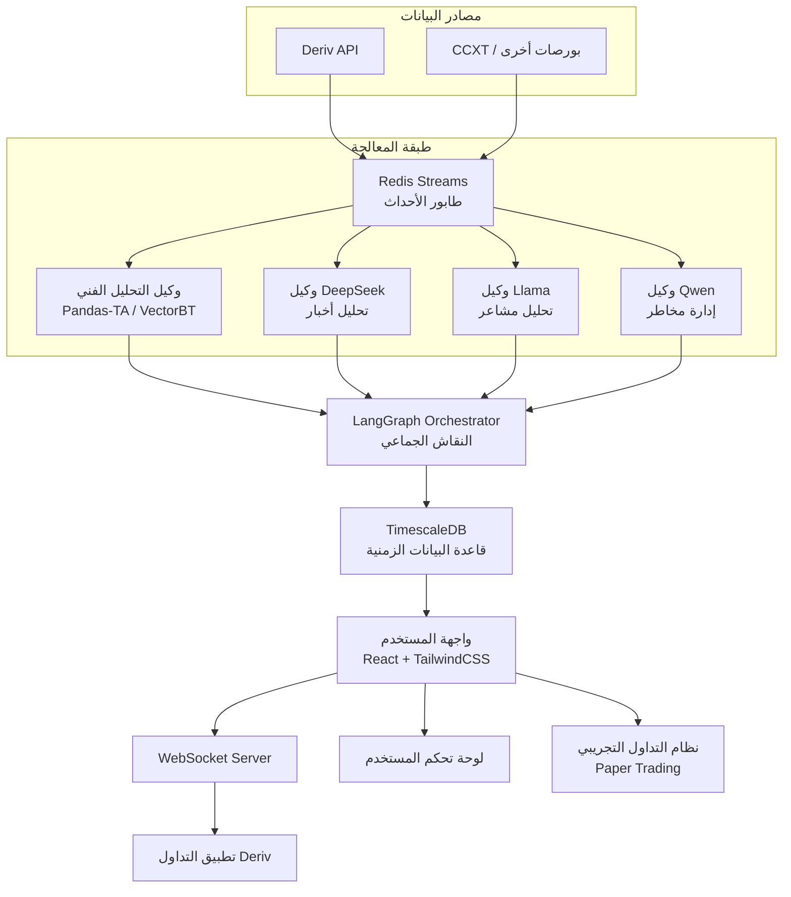
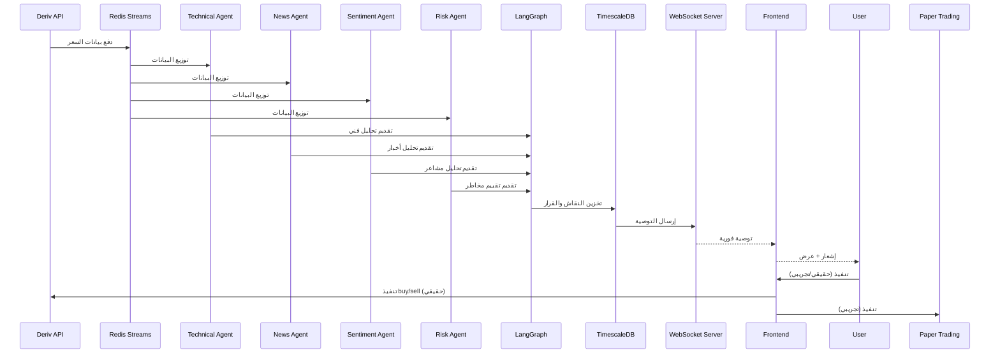

📘 الدليل الشامل لبناء نظام تداول ذكي متكامل مع Deriv API (الإصدار المتطور)

الإصدار: 3.0 | التاريخ: 2026-03-15
الهدف: توثيق كامل ومفصل لبناء موقع ويب **KhavaL Al Trade** متكامل يحلل الأسواق المالية باستخدام الذكاء الاصطناعي ويقدم توصيات تداول (صفقات صعود/هبوط) تعتمد على بيانات حقيقية من منصة Deriv، مع إمكانية تنفيذ الصفقات آلياً أو يدوياً، بالإضافة إلى نظام تداول تجريبي متكامل للاختبار الآمن. يعتمد هذا الدليل على أحدث المشاريع مفتوحة المصدر والبنى المعمارية المتطورة لضمان أعلى أداء واستقرار وأمان.

---

📑 جدول المحتويات

1. نظرة عامة على المشروع
2. المكونات الأساسية للنظام (الهيكل المطور)
3. الأدوات والمستودعات مفتوحة المصدر المستخدمة
   · 3.1 CCXT
   · 3.2 LangGraph / CrewAI (بديل NOFX)
   · 3.3 vLLM / Ollama (محرك تشغيل النماذج)
   · 3.4 نماذج الذكاء الاصطناعي (LLMs)
   · 3.5 OKX Agent Kit
   · 3.6 TimescaleDB (قاعدة البيانات الزمنية)
   · 3.7 Pandas-TA / VectorBT (التحليل الفني)
   · 3.8 Redis Streams (معالجة الأحداث)
   · 3.9 Deriv API
4. البنية التحتية للمشروع (المطورة)
5. المرحلة 1: إعداد الحسابات والحصول على مفاتيح API
6. المرحلة 2: إعداد بيئة التطوير
7. المرحلة 3: بناء طبقة الاتصال بمنصة Deriv
8. المرحلة 4: دمج CCXT لجلب بيانات متعددة المصادر
9. المرحلة 5: بناء محرك التحليل الفني والذكاء الاصطناعي (المطور)
   · 5.1 هيكلة الوكلاء المتعددين باستخدام LangGraph
   · 5.2 دمج نماذج LLM عبر vLLM/Ollama
   · 5.3 دمج OKX Agent Kit
   · 5.4 التحليل الفني باستخدام Pandas-TA/VectorBT
   · 5.5 آلية "الدراسة الجماعية" المتقدمة (النقاش بين الوكلاء)
   · 5.6 متخذ القرار النهائي
10. المرحلة 6: تطوير واجهة الويب
11. المرحلة 7: ربط النظام وإرسال الإشعارات (مع Redis Streams)
12. المرحلة 8: الاختبار والنشر
13. المرحلة 9: إدارة المخاطر والأمان
14. المرحلة 10: نظام التداول التجريبي (Paper Trading)
15. المراجع والمستودعات الموثوقة
16. الملاحق
17. جدول مقارنة: الهيكل الأصلي مقابل الهيكل المطور

---

1. نظرة عامة على المشروع

🎯 الرؤية

بناء منصة ويب ذكية (Dashboard) تعمل على مدار الساعة تقوم بتحليل الأسواق المالية باستخدام خوارزميات الذكاء الاصطناعي وتقديم توصيات تداول دقيقة (صفقات صعود/هبوط) بناءً على بيانات حقيقية من منصة Deriv، مع إمكانية تنفيذ الصفقات آلياً عبر API أو إرسال إشعارات للمستخدم لتنفيذها يدوياً. كما يتضمن النظام بيئة تداول تجريبية كاملة (Paper Trading) لاختبار الاستراتيجيات والتوصيات بدون مخاطرة مالية. تم تطوير البنية الأساسية لتعتمد على أحدث التقنيات في مجال الذكاء الاصطناعي وقواعد البيانات الزمنية ومعالجة الأحداث لضمان أعلى أداء واستقرار.

📊 آلية العمل (المطورة)

1. جلب البيانات من Deriv API و/أو منصات أخرى عبر CCXT.
2. إرسال البيانات إلى طابور Redis Streams لضمان عدم فقدان أي نقطة سعرية.
3. معالجة البيانات عبر عدة وكلاء ذكيين (AI Agents) يعملون بالتوازي، كل وكيل متخصص في جانب معين (تحليل فني، تحليل أخبار، تحليل مشاعر، إدارة مخاطر).
4. مرحلة "النقاش الجماعي" باستخدام إطار LangGraph حيث يتناقش الوكلاء ويتبادلون الآراء لتوليد توصية متوافقة.
5. توليد توصية نهائية تتضمن: نوع الصفقة (Call/Put)، وقت الانتهاء، ونسبة موثوقية محسوبة بدقة.
6. إرسال التوصية إلى واجهة المستخدم عبر WebSocket، مع إشعار فوري.
7. تنفيذ الصفقة (يدوياً من المستخدم، آلياً إذا كان مفعلاً، أو تجريبياً في وضع الاختبار).

---

2. المكونات الأساسية للنظام (الهيكل المطور)



شرح المكونات الموسع:

· مصادر البيانات: Deriv API (رسمي) و CCXT (للبورصات الأخرى).
· طابور الأحداث: Redis Streams – يضمن عدم فقدان البيانات ويسمح بمعالجة غير متزامنة.
· الوكلاء الذكيون: أربعة وكلاء متخصصين يعملون بالتوازي (تحليل فني، تحليل أخبار، تحليل مشاعر، إدارة مخاطر).
· منسق النقاش: LangGraph – يدير الحوار بين الوكلاء للوصول إلى توافق.
· قاعدة البيانات الزمنية: TimescaleDB – لتخزين واستعلام مليارات السجلات الزمنية بكفاءة.
· واجهة المستخدم: React + TailwindCSS مستوحاة من أفضل التصاميم.
· الإشعارات: WebSocket مع دعم إعادة الاتصال التلقائي.

---

3. الأدوات والمستودعات مفتوحة المصدر المستخدمة

3.1 CCXT

الرابط: https://github.com/ccxt/ccxt

التجربة العملية: مكتبة مستقرة منذ 2017، تُستخدم في آلاف المشاريع التجارية ومفتوحة المصدر. تدعم أكثر من 100 منصة تداول وتعتبر المعيار الفعلي للتعامل مع بورصات العملات الرقمية.

الوصف: مكتبة برمجية مفتوحة المصدر توفر واجهة موحدة لجلب بيانات السوق (الأسعار، الشموع، حجم التداول) وتنفيذ الصفقات.

دورها في المشروع:

· جلب بيانات تاريخية وحالية من منصات متعددة لتعزيز دقة التحليل.
· توفير بيانات احتياطية في حال تعطل Deriv API.
· إمكانية توسيع النظام ليشمل أصولاً من بورصات أخرى.

اللغات المدعومة: JavaScript, Python, PHP, C#, Go, Ruby, Swift, Kotlin.

3.2 LangGraph / CrewAI (بديل NOFX)

الرابط: https://github.com/langchain-ai/langgraph | https://github.com/crewaiinc/crewai

التجربة العملية: LangGraph هو الإطار الأحدث والأقوى من LangChain لبناء تطبيقات وكلاء ذكيين ذات تدفقات دورية ومعقدة. يستخدم في مشاريع ضخمة تتطلب تفاعلاً متعدد الخطوات بين النماذج.

الوصف: إطار عمل لإنشاء تدفقات عمل معقدة للوكلاء الذكيين (AI Agents) بشكل دوري (Cyclic). يتيح للوكلاء "التفكير المشترك" وتصحيح أخطاء بعضهم البعض قبل إصدار التوصية النهائية، بدلاً من مجرد الجمع الحسابي للأوزان.

دورها في المشروع:

· بناء "لجنة خبراء" حقيقية من وكلاء متخصصين.
· إدارة النقاش الجماعي للوصول إلى توافق أعلى دقة.
· توفير مرونة في إضافة أو إزالة وكلاء دون التأثير على البنية العامة.

3.3 vLLM / Ollama (محرك تشغيل النماذج)

الرابط: https://github.com/vllm-project/vllm | https://github.com/ollama/ollama

التجربة العملية: vLLM هو محرك الاستدلال (Inference Engine) الأسرع للنماذج مفتوحة المصدر، ويستخدم في شركات كبرى مثل OpenAI و Microsoft. Ollama يوفر واجهة مبسطة لإدارة النماذج محلياً.

الوصف:

· vLLM: محرك استدلال متقدم يضاعف سرعة توليد النصوص للنماذج مفتوحة المصدر (مثل DeepSeek و Llama) بـ 3 إلى 4 مرات باستخدام تقنية PagedAttention.
· Ollama: أداة ممتازة لإدارة النماذج محلياً بسهولة تامة وتوفير API متوافق مع OpenAI، مما يسهل تبديل النماذج برمجياً دون إعادة كتابة الكود.

دورها في المشروع:

· تشغيل النماذج المحلية بكفاءة عالية.
· تقليل زمن الاستجابة (Latency) للتوصيات.
· تسهيل إدارة إصدارات النماذج المختلفة.
### 3.4 نماذج الذكاء الاصطناعي (LLMs)

بناءً على تحليل شامل من MAS Markets (نوفمبر 2025)، هذه هي أفضل الخيارات المتاحة مع تقييم دقيق لكل منها:

| النموذج | الرابط | التجربة العملية | الأفضل لـ |
| :--- | :--- | :--- | :--- |
| **DeepSeek** | [github.com/deepseek-ai](https://github.com/deepseek-ai) | النموذج الأكثر استخداماً في مشاريع التداول المفتوحة المصدر | تحليل فني عام، أداء قوي بتكلفة منخفضة |
| **Qwen** | [github.com/QwenLM](https://github.com/QwenLM) | مستخدم بشكل أساسي في NOFX | تحليل متعدد اللغات، أسواق آسيوية |
| **Llama** | [github.com/meta-llama](https://github.com/meta-llama) | الأكثر شيوعاً للنشر المحلي | تحليل بيانات محايد، خصوصية كاملة |
| **Mistral** | [github.com/mistralai](https://github.com/mistralai) | نماذج Mixture-of-Experts كفؤة | تطبيقات حساسة للزمن والموارد |
| **FinGPT** | [github.com/AI4Finance-Foundation/FinGPT](https://github.com/AI4Finance-Foundation/FinGPT) | نموذج متخصص في التمويل | دقة عالية في التحليل المالي |
| **BloombergGPT** | (متوفر عبر تراخيص خاصة) | نموذج ضخم مدرب على بيانات مالية | تحليل تقارير معقدة |
| **OpenAI GPT-5/o-series** | [platform.openai.com](https://platform.openai.com) | الأفضل في البرمجة والتفكير متعدد الخطوات | نمذجة سريعة للاستراتيجيات |
| **Claude** | [anthropic.com](https://www.anthropic.com) | مفضل للوثائق والتحليل طويل السياق | توثيق النماذج، تحليل التقارير |
| **Gemini** | [deepmind.google/technologies/gemini](https://deepmind.google/technologies/gemini) | قوي جداً في تحليل المدخلات المتعددة | تحليل وثائق PDF، الخطب الاقتصادية |

3.5 OKX Agent Kit

الرابط: https://www.okx.com/help/mcp-agent-kit

الوصف: مجموعة أدوات مفتوحة المصدر من OKX تضم 83 أداة جاهزة تغطي:

· تحليل السوق (Market Analysis)
· تنفيذ الاستراتيجيات (Strategy Execution)
· إدارة المحافظ (Portfolio Management)
· مراقبة الأداء (Performance Monitoring)
· أدوات محاكاة (Simulation Tools)

التجربة العملية: تم إصدارها مارس 2026 وهي مبنية على خبرة OKX في التعامل مع ملايين المستخدمين. يمكن استخدام أدوات التحليل الجاهزة لتسريع التطوير بشكل كبير.

دورها في المشروع:

· استخدام أدوات التحليل الجاهزة لتسريع تطوير محرك الذكاء الاصطناعي.
· دعم وضع المحاكاة لاختبار الاستراتيجيات بأمان.
· التكامل مع OKX API (ويمكن تعديله للعمل مع Deriv).

3.6 TimescaleDB (قاعدة البيانات الزمنية)

الرابط: https://github.com/timescale/timescaledb

الوصف: امتداد (Extension) يعمل فوق PostgreSQL، مصمم خصيصاً للتعامل مع مليارات السجلات الزمنية (مثل بيانات الشموع والأسعار) بسرعة البرق.

التجربة العملية: تستخدمه شركات مثل Bloomberg و Siemens و Bosch لإدارة كميات هائلة من البيانات الزمنية.

دورها في المشروع:

· تخزين بيانات التداول (Ticks, OHLCV) بكفاءة.
· إجراء استعلامات معقدة (مثل تجميع الشموع) بسرعة فائقة عبر Continuous Aggregates.
· دعم كامل لـ SQL، مما يسهل التكامل مع الأدوات الأخرى.

3.7 Pandas-TA / VectorBT (التحليل الفني)

الرابط: https://github.com/twopirllc/pandas-ta | https://github.com/polakowo/vectorbt

الوصف:

· Pandas-TA: مكتبة حديثة مبنية فوق Pandas، تدعم أكثر من 130 مؤشراً فنياً، سهلة الدمج مع نماذج الذكاء الاصطناعي.
· VectorBT: مكتبة ضخمة جداً لتحليل البيانات واختبار الاستراتيجيات (Backtesting) بسرعة فائقة باستخدام المصفوفات (Numpy/Numba). يمكنها اختبار ملايين الاحتمالات للتوصيات في ثوانٍ.

دورها في المشروع:

· حساب المؤشرات الفنية (RSI, MACD, Bollinger Bands) بكفاءة.
· إجراء اختبارات رجعية سريعة للاستراتيجيات الجديدة.
· توفير بيانات غنية للوكلاء الذكيين.

3.8 Redis Streams (معالجة الأحداث)

الرابط: https://redis.io/docs/data-types/streams/

الوصف: بنية بيانات في Redis تتيح معالجة تدفقات الأحداث (Event Streams) بشكل موثوق وفعال.

التجربة العملية: يستخدم في آلاف التطبيقات لبناء أنظمة مراسلة عالية الأداء.

دورها في المشروع:

· استقبال بيانات السعر من Deriv و CCXT بشكل متدفق.
· ضمان عدم فقدان أي نقطة سعرية حتى في حال تعطل أحد الوكلاء.
· تمكين توزيع الحمل بين عدة نسخ من الوكلاء (Load Balancing).

3.9 Deriv API

الرابط: https://developers.deriv.com/

الوصف: واجهة برمجة تطبيقات رسمية لمنصة Deriv (الاسم السابق Binary.com). تدعم WebSocket للاتصال ثنائي الاتجاه.

التجربة العملية: منصة موثوقة بآلاف المستخدمين ووثائق ممتازة. هناك أمثلة رسمية بلغة Node.js و Python على GitHub.

دورها في المشروع:

· المصدر الرئيسي للبيانات.
· تنفيذ الصفقات آلياً.
· الحصول على معلومات الحساب.

أنواع التطبيقات المدعومة:

· PAT (Personal Access Token): للتطبيقات التي تعمل دون واجهة مستخدم.
· OAuth 2.0: لتطبيقات الويب التي تحتاج مصادقة المستخدمين.

---

4. البنية التحتية للمشروع (المطورة)

### 4.1 المكونات التقنية

| المكون | التقنية المقترحة | السبب |
| :--- | :--- | :--- |
| **الخادم الرئيسي (Orchestrator)** | Go (أو Node.js مع LangChain) | أداء عالٍ في معالجة WebSocket، دعم ممتاز لـ LangGraph |
| **قاعدة البيانات الزمنية** | TimescaleDB (PostgreSQL) | تخزين واستعلام سريع للبيانات الزمنية |
| **طابور الأحداث** | Redis Streams | ضمان عدم فقدان البيانات وتوزيع الحمل |
| **محرك تشغيل النماذج** | vLLM (للاستدلال السريع) | سرعة عالية وإدارة ذاكرة متطورة |
| **إدارة النماذج محلياً** | Ollama (اختياري) | سهولة التبديل بين النماذج |
| **الواجهة الأمامية** | React.js + TailwindCSS | مرونة وسرعة في التطوير |
| **الاتصال مع Deriv** | WebSocket (مكتبة `gorilla/websocket`) | أداء عالٍ |
| **الاتصال مع CCXT** | مكتبة CCXT بلغة Go | واجهة موحدة |
| **التحليل الفني** | Pandas-TA / VectorBT (Python microservices) | مكتبات حديثة وسريعة |
| **الإشعارات** | WebSocket + SSE | إشعارات فورية |

4.2 هيكل المجلدات المقترح (محدث)

```
deriv-ai-trader-v3/
├── cmd/
│   └── orchestrator/          # نقطة الدخول الرئيسية (Go)
├── internal/
│   ├── deriv-client/           # اتصال بـ Deriv
│   ├── ccxt-client/            # اتصال بـ CCXT
│   ├── redis-streams/          # التعامل مع Redis Streams
│   ├── agents/                  # الوكلاء الذكيون
│   │   ├── technical-agent/     # وكيل التحليل الفني (Python)
│   │   ├── news-agent/          # وكيل تحليل الأخبار (Python)
│   │   ├── sentiment-agent/     # وكيل تحليل المشاعر (Python)
│   │   └── risk-agent/          # وكيل إدارة المخاطر (Python)
│   ├── langgraph/               # تكامل LangGraph
│   ├── timescaledb/             # طبقة TimescaleDB
│   ├── websocket/                # خادم WebSocket
│   ├── paper-trading/            # نظام التداول التجريبي
│   └── api/                      # REST API
├── web/                          # واجهة React
├── config/                       # ملفات الإعدادات
├── scripts/                      # سكريبتات مساعدة
├── docs/                         # وثائق المشروع
├── docker-compose.yml
└── README.md
```

4.3 متطلبات النظام

· Go 1.22+ (لـ orchestrator)
· Node.js v20+ (للواجهة)
· Python 3.10+ (للخدمات المصغرة)
· TimescaleDB (أحدث إصدار)
· Redis 7+ (مع دعم Streams)
· vLLM و/أو Ollama (لتشغيل النماذج)
· ذاكرة RAM: 16GB كحد أدنى (32GB موصى به)
· GPU: (اختياري، لكن موصى به لتشغيل vLLM)

---

5. المرحلة 1: إعداد الحسابات والحصول على مفاتيح API

(نفس المحتوى السابق مع التأكيد على أهمية IP whitelisting وتدوير المفاتيح)

---

6. المرحلة 2: إعداد بيئة التطوير

(نفس المحتوى السابق مع إضافة TimescaleDB و Redis Streams)

```bash
# تثبيت TimescaleDB (بالإضافة إلى PostgreSQL)
sudo apt install postgresql-15-timescaledb

# تثبيت Redis
sudo apt install redis-server
```

---

7. المرحلة 3: بناء طبقة الاتصال بمنصة Deriv

(نفس المحتوى السابق مع تحسينات بسيطة)

---

8. المرحلة 4: دمج CCXT لجلب بيانات متعددة المصادر

(نفس المحتوى السابق)

---

9. المرحلة 5: بناء محرك التحليل الفني والذكاء الاصطناعي (المطور)

9.1 هيكلة الوكلاء المتعددين باستخدام LangGraph

سنقوم بتعريف عدة وكلاء متخصصين، ولكل وكيل دور محدد:

```python
# agents/definitions.py
from langgraph.graph import StateGraph, MessageGraph
from typing import TypedDict, List

class AgentState(TypedDict):
    market_data: dict
    technical_signals: dict
    news_sentiment: float
    social_sentiment: float
    risk_assessment: dict
    final_decision: dict
    messages: List[str]

# تعريف الوكلاء
def technical_agent(state: AgentState) -> AgentState:
    # حساب المؤشرات الفنية باستخدام Pandas-TA/VectorBT
    # تحديث state['technical_signals']
    return state

def news_agent(state: AgentState) -> AgentState:
    # تحليل آخر الأخبار باستخدام DeepSeek عبر vLLM
    # تحديث state['news_sentiment']
    return state

def sentiment_agent(state: AgentState) -> AgentState:
    # تحليل مشاعر وسائل التواصل باستخدام Llama عبر Ollama
    # تحديث state['social_sentiment']
    return state

def risk_agent(state: AgentState) -> AgentState:
    # تقييم المخاطر بناءً على حجم المركز والرصيد
    # تحديث state['risk_assessment']
    return state

def consensus_agent(state: AgentState) -> AgentState:
    # مناقشة جميع المدخلات والوصول إلى قرار
    # استخدام LangGraph للسماح بالحوار بين الوكلاء
    return state

# بناء الرسم البياني
builder = StateGraph(AgentState)
builder.add_node("technical", technical_agent)
builder.add_node("news", news_agent)
builder.add_node("sentiment", sentiment_agent)
builder.add_node("risk", risk_agent)
builder.add_node("consensus", consensus_agent)

# تحديد تدفق العمل
builder.set_entry_point("technical")
builder.add_edge("technical", "news")
builder.add_edge("news", "sentiment")
builder.add_edge("sentiment", "risk")
builder.add_edge("risk", "consensus")
builder.set_finish_point("consensus")

graph = builder.compile()
```

9.2 دمج نماذج LLM عبر vLLM/Ollama

vLLM سيتم تشغيله كخدمة منفصلة (Docker) تقدم API متوافق مع OpenAI:

```bash
# تشغيل vLLM مع نموذج DeepSeek
docker run --gpus all -p 8000:8000 vllm/vllm-openai \
    --model deepseek-ai/deepseek-r1-7b
```

ثم نستخدم هذا الـ API في الوكلاء:

```python
import openai

client = openai.OpenAI(
    base_url="http://localhost:8000/v1",
    api_key="dummy"  # vLLM لا يحتاج مفتاحاً حقيقياً
)

response = client.chat.completions.create(
    model="deepseek-ai/deepseek-r1-7b",
    messages=[{"role": "user", "content": prompt}]
)
```

Ollama يمكن استخدامه لإدارة النماذج بسهولة:

```bash
ollama pull llama4:7b
ollama run llama4:7b
```

9.3 دمج OKX Agent Kit

نستخدم OKX Agent Kit كأداة مساعدة في وكيل التحليل الفني:

```javascript
const OKXAgent = require('okx-agent-kit');

const agent = new OKXAgent({ simulation: true });

async function analyzeMarket(symbol, candles) {
    const analysis = await agent.marketAnalysis.patternRecognition(candles);
    const sentiment = await agent.marketAnalysis.sentimentAnalysis(symbol);
    return { analysis, sentiment };
}
```

9.4 التحليل الفني باستخدام Pandas-TA/VectorBT

Pandas-TA مثال بسيط:

```python
import pandas as pd
import pandas_ta as ta

def calculate_indicators(df):
    df.ta.rsi(length=14, append=True)
    df.ta.macd(append=True)
    df.ta.bbands(length=20, append=True)
    return df
```

VectorBT لاختبار استراتيجيات بسرعة هائلة:

```python
import vectorbt as vbt

price = pd.Series(...)
entries = price < price.rolling(20).mean()
exits = price > price.rolling(20).mean()

pf = vbt.Portfolio.from_signals(price, entries, exits)
pf.stats()
```

9.5 آلية "الدراسة الجماعية" المتقدمة (النقاش بين الوكلاء)

بدلاً من التصويت المرجح، نستخدم LangGraph لإنشاء نقاش حقيقي:

```python
def consensus_agent(state: AgentState) -> AgentState:
    # نجمع آراء جميع الوكلاء (موجودة في state['messages'])
    # نمررها إلى نموذج وسيط (مثل Llama) ليحلل التناقضات
    prompt = f"""
    أنت مدير فريق تداول. لديك آراء الخبراء التالية:
    - الخبير الفني: {state['technical_signals']}
    - خبير الأخبار: {state['news_sentiment']}
    - خبير المشاعر: {state['social_sentiment']}
    - مدير المخاطر: {state['risk_assessment']}
    
    بناءً على ذلك، ما هي التوصية النهائية (CALL/PUT/WAIT) مع ذكر الثقة وسبب القرار؟
    """
    
    response = client.chat.completions.create(
        model="llama4:7b",
        messages=[{"role": "user", "content": prompt}]
    )
    
    state['final_decision'] = parse_response(response.choices[0].message.content)
    return state
```

9.6 متخذ القرار النهائي

بعد النقاش، يتم إخراج التوصية النهائية التي تحتوي على:

· الاتجاه (CALL/PUT/WAIT)
· الثقة (نسبة مئوية)
· وقت الانتهاء الأمثل (بناءً على تحليل التقلبات)
· ملخص أسباب القرار (لعرضه للمستخدم)

---

10. المرحلة 6: تطوير واجهة الويب

10.1 استخدام واجهة NOFX كأساس (مع تعديلات)

NOFX توفر واجهة React احترافية مع:

· رسوم بيانية للأداء (Equity Curve)
· مقارنة فورية بين النماذج (Comparison Chart)
· لوحة متصدرين (Competition Leaderboard)
· سجل قرارات مفصل (Decision Logs)

10.2 التعديلات المطلوبة

· إضافة شاشة تسجيل الدخول باستخدام OAuth 2.0 من Deriv.
· تعديل مصدر البيانات ليشمل أصول Deriv.
· إضافة لوحة توصيات تعرض الإشارات المولدة مع نسبة الثقة.
· إضافة زر "تنفيذ الصفقة" (مع خيار تنفيذ حقيقي أو تجريبي).
· إضافة علامة تبويب خاصة بـ "التداول التجريبي".

10.3 المكونات الرئيسية للواجهة

1. شريط التنقل: عرض الرصيد (حقيقي وتجريبي).
2. لوحة الأصول: قائمة بأصول Deriv (R_100, EUR/USD، إلخ).
3. الرسم البياني: شموع يابانية مع مؤشرات فنية.
4. لوحة التوصيات: آخر التوصيات مع رأي كل نموذج.
5. سجل الصفقات: منفصل للحقيقي والتجريبي.
6. لوحة التحكم: إعدادات المخاطر والتنفيذ الآلي.
7. مؤشر وضع التداول: شريط علوي واضح (حقيقي/تجريبي).

---

11. المرحلة 7: ربط النظام وإرسال الإشعارات (مع Redis Streams)

11.1 تدفق البيانات الكامل



11.2 تنفيذ WebSocket Server في Go مع دعم Redis

```go
// internal/websocket/server.go
package websocket

import (
    "github.com/gorilla/websocket"
    "github.com/go-redis/redis/v8"
    "net/http"
    "sync"
)

type Server struct {
    upgrader websocket.Upgrader
    clients  map[*websocket.Conn]bool
    mu       sync.Mutex
    redis    *redis.Client
}

func NewServer(redisAddr string) *Server {
    return &Server{
        upgrader: websocket.Upgrader{
            CheckOrigin: func(r *http.Request) bool { return true },
        },
        clients: make(map[*websocket.Conn]bool),
        redis:   redis.NewClient(&redis.Options{Addr: redisAddr}),
    }
}

func (s *Server) HandleConnections(w http.ResponseWriter, r *http.Request) {
    conn, _ := s.upgrader.Upgrade(w, r, nil)
    s.mu.Lock()
    s.clients[conn] = true
    s.mu.Unlock()

    // الاشتراك في قناة Redis للإشارات
    pubsub := s.redis.Subscribe(ctx, "signals")
    go func() {
        for msg := range pubsub.Channel() {
            conn.WriteMessage(websocket.TextMessage, []byte(msg.Payload))
        }
    }()
}

func (s *Server) BroadcastSignal(signal interface{}) {
    // إرسال الإشارة إلى Redis Stream
    s.redis.Publish(ctx, "signals", signal)
}
```

11.3 تخزين الإشارات في TimescaleDB

```sql
-- جدول الإشارات (محدث)
CREATE TABLE signals (
    id SERIAL PRIMARY KEY,
    symbol VARCHAR(20),
    signal_type VARCHAR(4) CHECK (signal_type IN ('CALL', 'PUT')),
    confidence DECIMAL,
    expiry_time INTEGER,
    generated_at TIMESTAMP DEFAULT NOW(),
    executed BOOLEAN DEFAULT FALSE,
    execution_result JSONB,
    agent_votes JSONB, -- تخزين آراء الوكلاء
    final_confidence DECIMAL,
    decision_log TEXT -- ملخص النقاش
);

SELECT create_hypertable('signals', 'generated_at'); -- تحويل إلى hypertable
```

---

12. المرحلة 8: الاختبار والنشر

12.1 الاختبار على الحساب التجريبي

· Deriv يوفر حساباً تجريبياً بأموال وهمية.
· شغّل النظام بالكامل على الحساب التجريبي لمدة أسبوعين على الأقل.
· سجل جميع التوصيات وقارنها بالنتائج الفعلية.
· احسب دقة النظام (Accuracy) ومتوسط الربح/الخسارة.

12.2 تحسين الأداء

· استخدم Redis Streams للتخزين المؤقت وتوزيع الحمل.
· استخدم vLLM لتسريع استدلال النماذج.
· أضف فهارس (indexes) على حقول الاستعلام المتكررة في TimescaleDB.
· استخدم load balancing لتوزيع الحمل بين عدة نسخ من الوكلاء.

12.3 النشر على خادم حقيقي

الخيارات:

· VPS (مثل DigitalOcean, Linode): تحكم كامل، مناسب للتجارب.
· AWS EC2: قابلية توسع عالية.
· Google Cloud Run: serverless للخلفية.

خطوات النشر:

1. شراء نطاق (domain) وشهادة SSL (Let's Encrypt).
2. إعداد Nginx كـ reverse proxy.
3. تشغيل الخادم باستخدام systemd أو Docker.
4. نشر الواجهة الأمامية على Netlify أو Vercel.

12.4 المراقبة والتسجيل

· استخدام Prometheus + Grafana لمراقبة الأداء.
· تسجيل جميع الأخطاء في نظام مركزي (مثل Sentry).
· مراقبة أداء كل وكيل على حدة.

---

13. المرحلة 9: إدارة المخاطر والأمان

13.1 إدارة المخاطر للمستخدم

· حد الخسارة اليومي: لا يمكن تنفيذ صفقات إذا تجاوزت الخسارة حداً معيناً.
· الحد الأقصى للصفقة: نسبة من الرصيد (مثلاً 2%).
· نسبة المخاطرة إلى العائد (Risk-Reward): إلزامية ≥ 1:2.
· منع تكرار الصفقات: لا فتح مراكز مكررة لنفس الأصل/الاتجاه.
· إدارة الهامش: إجمالي الاستخدام ≤ 90% من الرصيد.

13.2 أمان النظام (بناءً على تجارب سابقة)

· HTTPS إلزامي.
· تغيير الإعدادات الافتراضية فوراً:
  · تغيير JWT secret الافتراضي.
  · تعطيل أي واجهات إدارة (admin mode) غير ضرورية.
· تشفير مفاتيح API في قاعدة البيانات (AES-256).
· IP whitelisting لمفاتيح البورصات.
· فصل الصلاحيات: مفاتيح منفصلة للقراءة والتداول.
· معدل الطلبات (Rate Limiting) لمنع هجمات DDoS.
· التحقق من صحة المدخلات (Input Validation) لجميع الطلبات.

13.3 الامتثال القانوني

· إضافة إخلاء مسؤولية (Disclaimer) بأن التداول ينطوي على مخاطر عالية.
· عدم تقديم وعود بأرباح.
· الالتزام بقوانين بلد المستخدم (خاصة فيما يتعلق بالخيارات الثنائية).
· توضيح الفرق بين التداول الحقيقي والتجريبي في الواجهة.

---

14. المرحلة 10: نظام التداول التجريبي (Paper Trading)

14.1 ما هو نظام التداول التجريبي ولماذا تحتاجه

نظام التداول التجريبي هو بيئة تحاكي السوق الحقيقي بشكل كامل، ولكن باستخدام أموال وهمية. يسمح للمستخدم (ولك أنت كمطور) باختبار استراتيجيات التداول ودقة توصيات الذكاء الاصطناعي بدون أي مخاطرة مالية.

الفوائد:

· اختبار دقة النظام على المدى الطويل قبل المخاطرة بأموال حقيقية.
· تدريب المستخدمين الجدد على التداول دون خوف.
· تجربة استراتيجيات جديدة وتعديلها.
· بناء الثقة في النظام قبل التحول للحقيقي.
· تحسين نماذج الذكاء الاصطناعي باستخدام بيانات من التداول التجريبي.

14.2 كيف يعمل نظام التداول التجريبي

14.2.1 الرصيد الافتراضي

· عند تسجيل المستخدم في النظام، يتم إنشاء محفظة تجريبية له برصيد افتراضي (مثلاً 10,000 دولار).
· يمكن للمستخدم إعادة تعيين الرصيد التجريبي إلى قيمته الافتراضية متى شاء.

14.2.2 بيانات السوق الحقيقية

· نظام التداول التجريبي يستخدم نفس مصادر البيانات الحقيقية (Deriv API و CCXT).
· الأسعار في الوضع التجريبي مطابقة تماماً للأسعار في الوضع الحقيقي.
· المؤشرات الفنية والرسوم البيانية متطابقة.

14.2.3 تنفيذ الصفقات التجريبية

عندما يختار المستخدم "تنفيذ تجريبي" لتوصية معينة:

1. يتم التحقق من توفر الرصيد التجريبي الكافي.
2. يتم خصم المبلغ المطلوب من الرصيد التجريبي.
3. يتم تسجيل الصفقة في جدول paper_trades مع وقت الافتتاح.
4. عند انتهاء العقد، يتم حساب الربح/الخسارة بناءً على السعر الحقيقي.
5. يتم تحديث الرصيد التجريبي.
6. يتم إشعار المستخدم بالنتيجة.

14.3 بنية قاعدة البيانات للتداول التجريبي

```sql
-- جدول المحافظ التجريبية
CREATE TABLE paper_wallets (
    id SERIAL PRIMARY KEY,
    user_id INTEGER REFERENCES users(id) UNIQUE,
    balance DECIMAL DEFAULT 10000.00,
    currency VARCHAR(10) DEFAULT 'USD',
    created_at TIMESTAMP DEFAULT NOW()
);

-- جدول الصفقات التجريبية
CREATE TABLE paper_trades (
    id SERIAL PRIMARY KEY,
    user_id INTEGER REFERENCES users(id),
    signal_id INTEGER REFERENCES signals(id),
    symbol VARCHAR(20),
    direction VARCHAR(4),
    amount DECIMAL,
    entry_price DECIMAL,
    exit_price DECIMAL,
    profit DECIMAL,
    status VARCHAR(10),
    opened_at TIMESTAMP DEFAULT NOW(),
    closed_at TIMESTAMP,
    expiry_time INTEGER
);
```

14.4 واجهة المستخدم للتداول التجريبي

· شريط علوي ملون (أخضر فاتح) يبين وضع "التداول التجريبي".
· عرض الرصيد التجريبي بشكل بارز.
· زر "إعادة تعيين الرصيد التجريبي" لإعادة الرصيد إلى 10,000$ افتراضياً.
· علامة تبويب منفصلة لسجل الصفقات التجريبية.
· أزرار تنفيذ منفصلة: "تنفيذ حقيقي" و "تنفيذ تجريبي".

---

## 15. المراجع والمستودعات الموثوقة

| الاسم | الرابط | الوصف | التجربة العملية |
| :--- | :--- | :--- | :--- |
| **LangGraph** | [github.com/langchain-ai/langgraph](https://github.com/langchain-ai/langgraph) | إطار لبناء وكلاء ذكيين بتدفقات دورية | أحدث مشروع من LangChain، يستخدم في تطبيقات معقدة |
| **vLLM** | [github.com/vllm-project/vllm](https://github.com/vllm-project/vllm) | محرك استدلال سريع للنماذج | أسرع بـ 3-4 مرات من الطرق التقليدية |
| **TimescaleDB** | [github.com/timescale/timescaledb](https://github.com/timescale/timescaledb) | قاعدة بيانات زمنية مبنية على PostgreSQL | تستخدم في Bloomberg و Siemens |
| **Pandas-TA** | [github.com/twopirllc/pandas-ta](https://github.com/twopirllc/pandas-ta) | مكتبة مؤشرات فنية حديثة | أكثر من 130 مؤشراً، سهلة التكامل |
| **VectorBT** | [github.com/polakowo/vectorbt](https://github.com/polakowo/vectorbt) | أداة اختبار استراتيجيات فائقة السرعة | قادرة على اختبار ملايين السيناريوهات في ثوانٍ |
| **Redis Streams** | [redis.io/docs/data-types/streams](https://redis.io/docs/data-types/streams) | طابور رسائل موثوق | معيار صناعي لمعالجة التدفقات |
| **CCXT** | [github.com/ccxt/ccxt](https://github.com/ccxt/ccxt) | مكتبة التداول الموحدة | المعيار الفعلي، مستخدم في آلاف المشاريع |
| **DeepSeek** | [github.com/deepseek-ai](https://github.com/deepseek-ai) | نموذج ذكاء اصطناعي قوي | مستخدم في مشاريع تداول كبرى |
| **Qwen** | [github.com/QwenLM](https://github.com/QwenLM) | نموذج متعدد اللغات | مستخدم في NOFX |
| **Llama** | [github.com/meta-llama](https://github.com/meta-llama) | نموذج مفتوح من Meta | الأكثر شيوعاً للنشر المحلي |
| **FinGPT** | [github.com/AI4Finance-Foundation/FinGPT](https://github.com/AI4Finance-Foundation/FinGPT) | نموذج متخصص في التمويل | دقة عالية في التحليل المالي |
| **OKX Agent Kit** | [okx.com/help/mcp-agent-kit](https://www.okx.com/help/mcp-agent-kit) | أدوات تحليل جاهزة | إصدار مارس 2026، 83 أداة |
| **Deriv API** | [developers.deriv.com](https://developers.deriv.com) | واجهة Deriv الرسمية | وثائق ممتازة، أمثلة متعددة |
| **SlowMist Security** | [slowmist.com](https://slowmist.com) | تقارير أمنية | كشفت ثغرات NOFX |
| **OWASP API Security** | [owasp.org/API-Security](https://owasp.org/API-Security) | أفضل ممارسات الأمان | مرجع أساسي للأمان |

---

16. الملاحق

الملحق أ: قائمة الرموز المدعومة في Deriv

· مؤشرات التقلب: R_10, R_25, R_50, R_75, R_100, إلخ.
· أزواج العملات: EUR/USD, GBP/USD, AUD/USD, إلخ.
· السلع: الذهب (XAU/USD)، الفضة (XAG/USD).
· العملات الرقمية: BTC/USD, ETH/USD (عبر CFD).

يمكن الحصول على القائمة الكاملة عبر طلب active_symbols: 1.

الملحق ب: هيكل قاعدة البيانات الكامل (محدث)

```sql
-- جدول المستخدمين
CREATE TABLE users (
    id SERIAL PRIMARY KEY,
    deriv_account_id VARCHAR(50) UNIQUE,
    email VARCHAR(255) UNIQUE,
    api_token_encrypted TEXT,
    created_at TIMESTAMP DEFAULT NOW(),
    risk_daily_limit DECIMAL,
    max_trade_amount DECIMAL,
    auto_trade BOOLEAN DEFAULT FALSE
);

-- جدول الإشارات (مع دعم TimescaleDB)
CREATE TABLE signals (
    id SERIAL PRIMARY KEY,
    symbol VARCHAR(20),
    signal_type VARCHAR(4) CHECK (signal_type IN ('CALL', 'PUT')),
    confidence DECIMAL,
    expiry_time INTEGER,
    generated_at TIMESTAMP DEFAULT NOW(),
    executed BOOLEAN DEFAULT FALSE,
    execution_result JSONB,
    agent_votes JSONB,
    final_confidence DECIMAL,
    decision_log TEXT
);
SELECT create_hypertable('signals', 'generated_at');

-- جدول الصفقات الحقيقية
CREATE TABLE real_trades (
    id SERIAL PRIMARY KEY,
    user_id INTEGER REFERENCES users(id),
    signal_id INTEGER REFERENCES signals(id),
    contract_id VARCHAR(100),
    amount DECIMAL,
    profit DECIMAL,
    status VARCHAR(20),
    opened_at TIMESTAMP,
    closed_at TIMESTAMP
);

-- جدول المحافظ التجريبية
CREATE TABLE paper_wallets (
    id SERIAL PRIMARY KEY,
    user_id INTEGER REFERENCES users(id) UNIQUE,
    balance DECIMAL DEFAULT 10000.00,
    currency VARCHAR(10) DEFAULT 'USD',
    created_at TIMESTAMP DEFAULT NOW()
);

-- جدول الصفقات التجريبية
CREATE TABLE paper_trades (
    id SERIAL PRIMARY KEY,
    user_id INTEGER REFERENCES users(id),
    signal_id INTEGER REFERENCES signals(id),
    symbol VARCHAR(20),
    direction VARCHAR(4),
    amount DECIMAL,
    entry_price DECIMAL,
    exit_price DECIMAL,
    profit DECIMAL,
    status VARCHAR(10),
    opened_at TIMESTAMP DEFAULT NOW(),
    closed_at TIMESTAMP,
    expiry_time INTEGER
);

-- جدول أداء الوكلاء
CREATE TABLE agent_performance (
    id SERIAL PRIMARY KEY,
    agent_name VARCHAR(50),
    date DATE,
    total_predictions INTEGER,
    correct_predictions INTEGER,
    accuracy DECIMAL,
    weight DECIMAL DEFAULT 1.0,
    updated_at TIMESTAMP DEFAULT NOW()
);

-- إنشاء الفهارس
CREATE INDEX idx_signals_generated ON signals(generated_at DESC);
CREATE INDEX idx_real_trades_user ON real_trades(user_id);
CREATE INDEX idx_paper_trades_user ON paper_trades(user_id);
CREATE INDEX idx_agent_performance_name_date ON agent_performance(agent_name, date);
```

الملحق ج: تثبيت وتكوين TimescaleDB

```sql
-- إنشاء قاعدة بيانات مع TimescaleDB
CREATE DATABASE trading_data;
\c trading_data
CREATE EXTENSION IF NOT EXISTS timescaledb;

-- إنشاء جدول للشموع وتحويله إلى hypertable
CREATE TABLE candles (
    time TIMESTAMPTZ NOT NULL,
    symbol VARCHAR(20) NOT NULL,
    open DECIMAL,
    high DECIMAL,
    low DECIMAL,
    close DECIMAL,
    volume DECIMAL
);
SELECT create_hypertable('candles', 'time');

-- استعلامات سريعة: مثلاً تجميع الشموع بدقيقة
SELECT time_bucket('1 minute', time) AS minute,
       symbol,
       FIRST(open, time) AS open,
       MAX(high) AS high,
       MIN(low) AS low,
       LAST(close, time) AS close,
       SUM(volume) AS volume
FROM candles
GROUP BY minute, symbol;
```

الملحق د: تشغيل vLLM مع Docker

```bash
# تشغيل خادم vLLM مع نموذج DeepSeek
docker run --runtime nvidia -e NVIDIA_VISIBLE_DEVICES=all \
    -p 8000:8000 \
    -v ~/.cache/huggingface:/root/.cache/huggingface \
    --ipc=host \
    vllm/vllm-openai:latest \
    --model deepseek-ai/deepseek-r1-7b \
    --tensor-parallel-size 2  # إذا كان لديك GPU متعدد
```

الملحق هـ: قائمة تحقق أمنية (من تجارب سابقة)

· تغيير JWT secret الافتراضي
· تعطيل أي واجهات إدارة غير ضرورية
· تفعيل IP whitelisting لمفاتيح API
· فصل مفاتيح القراءة عن التداول
· تدوير المفاتيح بشكل دوري
· تشفير البيانات الحساسة في قاعدة البيانات
· تفعيل HTTPS
· إضافة rate limiting
· تدقيق صلاحيات API endpoints
· مراجعة سريعة من OWASP API Top 10

---

### الملحق و: مصادر تعلم إضافية

*   **LangGraph Documentation:** [langchain-ai.github.io/langgraph](https://langchain-ai.github.io/langgraph)
*   **vLLM Official Docs:** [vllm.readthedocs.io](https://vllm.readthedocs.io)
*   **TimescaleDB Tutorials:** [docs.timescale.com](https://docs.timescale.com)
*   **VectorBT Examples:** [github.com/polakowo/vectorbt](https://github.com/polakowo/vectorbt)
*   **OWASP API Security Top 10:** [owasp.org/API-Security](https://owasp.org/API-Security)
*   **SlowMist Security Reports:** [slowmist.com](https://slowmist.com)

---

## 17. جدول مقارنة: الهيكل الأصلي مقابل الهيكل المطور

| المكون | المقترح في الدليل الأصلي (الإصدار 2.0) | البديل/الإضافة المقترحة (الإصدار 3.0) | سبب التفضيل التقني |
| :--- | :--- | :--- | :--- |
| **نواة اتخاذ القرار** | NOFX / تصويت رياضي مرجح | LangGraph / CrewAI (نقاش حقيقي بين الوكلاء) | يتيح تفاعلاً أعمق بين النماذج، وصولاً لتوصيات أكثر دقة |
| **تشغيل النماذج** | Transformers + FastAPI | vLLM / Ollama | سرعة استدلال أعلى بـ 3-4 مرات، إدارة ذاكرة متطورة |
| **قاعدة البيانات** | PostgreSQL + Redis | TimescaleDB + Redis Streams | أداء فائق في استعلامات السلاسل الزمنية، دعم تجميع لحظي |
| **التحليل الفني** | TA-Lib | Pandas-TA / VectorBT | مكتبات أحدث وأسرع، تكامل سلس مع Python، قدرات Backtesting هائلة |
| **معالجة التدفقات** | WebSocket مباشر | Redis Streams + WebSocket | يمنع فقدان البيانات، يسمح بتوزيع الحمل على عدة وكلاء |
| **نماذج متخصصة** | نماذج عامة | FinGPT / BloombergGPT | دقة أعلى في التحليل المالي بفضل التدريب على بيانات مالية |

✅ خلاصة

هذا الدليل الشامل (الإصدار 3.0) يقدم لك خارطة طريق متكاملة لبناء نظام تداول ذكي من الطراز الأول، يعتمد على أحدث الأبحاث والتقنيات في مجال الذكاء الاصطناعي وقواعد البيانات ومعالجة الأحداث. باستخدام بنية الوكلاء المتعددين (LangGraph)، ومحرك الاستدلال السريع (vLLM)، وقاعدة البيانات الزمنية (TimescaleDB)، يمكنك بناء نظام ليس فقط دقيقاً، بل قابلاً للتوسع والتطور ليصبح صندوق استثماري مصغر (Hedge Fund) يعمل بشكل آلي.

تذكر دائماً: التداول يحمل مخاطر عالية. ابدأ بالتداول التجريبي لفترة كافية، طبق إجراءات الأمان بدقة، ولا تخاطر بأموال لا يمكنك تحمل خسارتها.

حظاً موفقاً في بناء مستقبل التداول الذكي!
