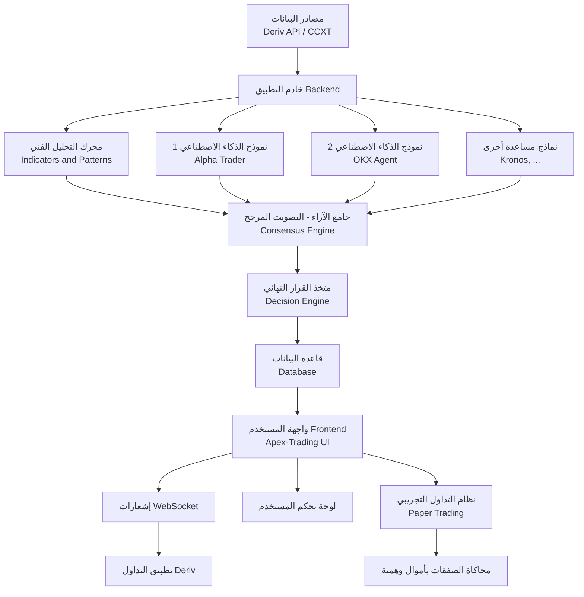
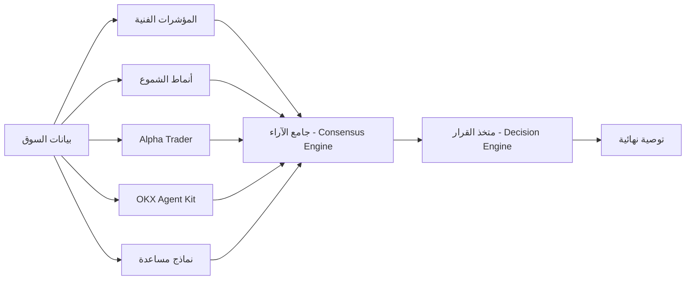
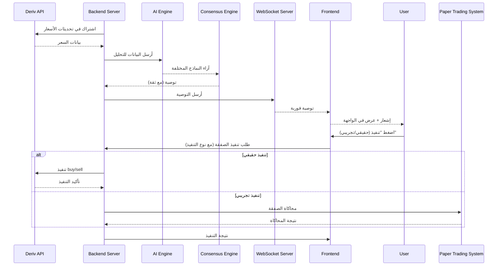

📘 الدليل الشامل لبناء نظام تداول ذكي متكامل مع Deriv API

الإصدار: 1.1 | التاريخ: 2026-03-14
الهدف: توثيق كامل ومفصل لبناء موقع ويب متكامل يحلل الأسواق المالية باستخدام الذكاء الاصطناعي ويقدم توصيات تداول (صفقات صعود/هبوط) تعتمد على بيانات حقيقية من منصة Deriv، مع إمكانية تنفيذ الصفقات آلياً أو يدوياً، بالإضافة إلى نظام تداول تجريبي متكامل للاختبار الآمن.

---

📑 جدول المحتويات

1. نظرة عامة على المشروع
2. المكونات الأساسية للنظام
3. الأدوات والمستودعات مفتوحة المصدر المستخدمة
   · 3.1 CCXT
   · 3.2 Apex-Trading
   · 3.3 Alpha Trader
   · 3.4 OKX Agent Kit
   · 3.5 Deriv API
4. البنية التحتية للمشروع
5. المرحلة 1: إعداد الحسابات والحصول على مفاتيح API
6. المرحلة 2: إعداد بيئة التطوير
7. المرحلة 3: بناء طبقة الاتصال بمنصة Deriv
8. المرحلة 4: دمج CCXT لجلب بيانات متعددة المصادر
9. المرحلة 5: بناء محرك التحليل الفني والذكاء الاصطناعي
   · 5.1 دمج Alpha Trader
   · 5.2 دمج OKX Agent Kit
   · 5.3 تكامل المحركين
   · 5.4 آلية "الدراسة الجماعية" والتصويت المرجح (Multi-Model Consensus)
   · 5.5 متخذ القرار النهائي
10. المرحلة 6: تطوير واجهة الويب باستخدام Apex-Trading
11. المرحلة 7: ربط النظام وإرسال الإشعارات
12. المرحلة 8: الاختبار والنشر
13. المرحلة 9: إدارة المخاطر والأمان
14. المرحلة 10: نظام التداول التجريبي (Paper Trading)
    · 10.1 ما هو نظام التداول التجريبي ولماذا تحتاجه
    · 10.2 كيف يعمل نظام التداول التجريبي
    · 10.3 بنية قاعدة البيانات للتداول التجريبي
    · 10.4 واجهة المستخدم للتداول التجريبي
    · 10.5 التكامل مع النظام الرئيسي
15. المراجع والمستودعات
16. الملاحق

---

1. نظرة عامة على المشروع

🎯 الرؤية

بناء منصة ويب ذكية (Dashboard) تعمل على مدار الساعة تقوم بتحليل الأسواق المالية باستخدام خوارزميات الذكاء الاصطناعي وتقديم توصيات تداول دقيقة (صفقات صعود/هبوط) بناءً على بيانات حقيقية من منصة Deriv، مع إمكانية تنفيذ الصفقات آلياً عبر API أو إرسال إشعارات للمستخدم لتنفيذها يدوياً. كما يتضمن النظام بيئة تداول تجريبية كاملة (Paper Trading) لاختبار الاستراتيجيات والتوصيات بدون مخاطرة مالية.

📊 آلية العمل

1. جلب البيانات من Deriv API و/أو منصات أخرى عبر CCXT.
2. تحليل البيانات باستخدام المؤشرات الفنية وأنماط الشموع.
3. تطبيق نماذج الذكاء الاصطناعي المتعددة (Alpha Trader, OKX Agent Kit، ونماذج مساعدة) بالتوازي.
4. مرحلة "الدراسة الجماعية" حيث تتناقش النماذج وتصوت على التوصية الأفضل.
5. توليد توصية نهائية تتضمن: نوع الصفقة (Call/Put)، وقت الانتهاء، ونسبة موثوقية محسوبة بدقة.
6. إرسال التوصية إلى واجهة المستخدم عبر WebSocket، مع إشعار فوري.
7. تنفيذ الصفقة (يدوياً من المستخدم، آلياً إذا كان مفعلاً، أو تجريبياً في وضع الاختبار).

---

2. المكونات الأساسية للنظام



شرح المكونات الموسع:

· مصادر البيانات: Deriv API (رسمي) و CCXT (للبورصات الأخرى).
· الخادم: Node.js (Express) مع دعم WebSocket.
· محرك التحليل الفني: مكتبات مخصصة لحساب RSI, MACD, Bollinger Bands، إلخ.
· نماذج الذكاء الاصطناعي المتعددة:
  · Alpha Trader (DeepSeek-R1 + Kronos)
  · OKX Agent Kit (83 أداة تحليل)
  · نماذج مساعدة (يمكن إضافتها مستقبلاً)
· جامع الآراء (Consensus Engine): يجمع مخرجات النماذج المختلفة ويطبق نظام التصويت المرجح.
· متخذ القرار النهائي: يدمج نتائج التحليل الفني والتصويت لإصدار توصية نهائية بثقة محسوبة.
· قاعدة البيانات: PostgreSQL لتخزين المستخدمين والصفقات والسجلات.
· واجهة المستخدم: مستوحاة من Apex-Trading (React + TailwindCSS).
· الإشعارات: WebSocket لإرسال التوصيات فور توليدها.
· التنفيذ الآلي: ربط مباشر مع Deriv API عبر WebSocket لتنفيذ الصفقات.
· نظام التداول التجريبي: يحاكي السوق الحقيقي بأموال وهمية ويستخدم نفس البيانات الحية.

---

3. الأدوات والمستودعات مفتوحة المصدر المستخدمة

3.1 CCXT

الرابط: https://github.com/ccxt/ccxt

الوصف: مكتبة برمجية مفتوحة المصدر تدعم أكثر من 100 منصة تداول للعملات الرقمية. توفر واجهة موحدة لجلب بيانات السوق (الأسعار، الشموع، حجم التداول) وتنفيذ الصفقات.

دورها في المشروع:

· جلب بيانات تاريخية وحالية من منصات متعددة لتعزيز دقة التحليل.
· توفير بيانات احتياطية في حال تعطل Deriv API.
· إمكانية توسيع النظام ليشمل أصولاً من بورصات أخرى.

اللغات المدعومة: JavaScript, Python, PHP, C#, Go, Ruby, Swift, Kotlin.

3.2 Apex-Trading

الرابط: https://github.com/bhanukaranwal/Apex-Trading

الوصف: منصة تداول احترافية كاملة مفتوحة المصدر، تتضمن واجهة أمامية (React) وخلفية (FastAPI) مع دعم WebSocket للتحديثات المباشرة. تحتوي على محرك إشارات ذكاء اصطناعي مبني على نماذج LSTM/Transformer.

دورها في المشروع:

· استخدام واجهتها الأمامية الجاهزة كأساس لموقعنا (توفير وقت كبير).
· الاستفادة من محرك WebSocket المدمج لإرسال الإشارات.
· الاستلهام من بنيتها التحتية لتسريع التطوير.

3.3 Alpha Trader

الرابط: https://github.com/daniel-mi/Alpha-Trader

الوصف: نظام تداول كمي آلي بالكامل يستخدم نموذج DeepSeek-R1 70B (ذكاء اصطناعي محلي) لتحليل السوق واتخاذ القرارات. يدمج بين:

· نموذج Kronos للتنبؤ بالشموع الخمس القادمة.
· تحليل الأخبار والمشاعر الاجتماعية.
· مؤشرات فنية متعددة.

دورها في المشروع:

· استخدام نموذج DeepSeek-R1 للتنبؤات عالية الدقة.
· دمج Kronos لتحليل الشموع.
· الاستفادة من محرك تحليل الأخبار.

3.4 OKX Agent Kit

الرابط: https://www.okx.com/zh-hans/help/mcp-agent-kit

الوصف: مجموعة أدوات مفتوحة المصدر من OKX تضم 83 أداة جاهزة تغطي:

· تحليل السوق (Market Analysis)
· تنفيذ الاستراتيجيات (Strategy Execution)
· إدارة المحافظ (Portfolio Management)
· مراقبة الأداء (Performance Monitoring)
· أدوات محاكاة (Simulation Tools)

دورها في المشروع:

· استخدام أدوات التحليل الجاهزة لتسريع التطوير.
· دعم وضع المحاكاة لاختبار الاستراتيجيات بأمان.
· التكامل مع OKX API (ويمكن تعديله للعمل مع Deriv).

3.5 Deriv API

الرابط: https://developers.deriv.com/

الوصف: واجهة برمجة تطبيقات رسمية لمنصة Deriv. تدعم WebSocket للاتصال ثنائي الاتجاه، وتتيح:

· جلب بيانات السوق (الأسعار، الشموع، المؤشرات).
· تنفيذ صفقات الخيارات الثنائية والعقود الرقمية.
· إدارة الحساب (الرصيد، سجل الصفقات).

دورها في المشروع:

· المصدر الرئيسي للبيانات.
· تنفيذ الصفقات آلياً.
· الحصول على معلومات الحساب.

أنواع التطبيقات المدعومة:

· PAT (Personal Access Token): للتطبيقات التي تعمل دون واجهة مستخدم.
· OAuth 2.0: لتطبيقات الويب التي تحتاج مصادقة المستخدمين.

---

4. البنية التحتية للمشروع

4.1 المكونات التقنية

المكون التقنية المقترحة السبب
الخادم (Backend) Node.js + Express.js أداء عالٍ في معالجة WebSocket، مجتمع كبير
الواجهة (Frontend) React.js + TailwindCSS مرونة وسرعة في التطوير، دعم مكونات جاهزة
قاعدة البيانات PostgreSQL + Redis PostgreSQL للبيانات العلائقية، Redis للتخزين المؤقت
الاتصال مع Deriv ws (مكتبة WebSocket) مباشرة وسريعة
الاتصال مع CCXT ccxt (npm) واجهة موحدة
الذكاء الاصطناعي TensorFlow.js + Python Microservices TensorFlow.js للتوقعات الخفيفة، Python للنماذج الثقيلة
الإشعارات WebSocket + SSE إشعارات فورية
التخزين السحابي AWS S3 أو Cloudflare R2 لتخزين الصور والملفات

4.2 هيكل المجلدات المقترح

```
deriv-ai-trader/
├── backend/
│   ├── src/
│   │   ├── deriv-client/          # الاتصال بـ Deriv
│   │   ├── ccxt-client/           # الاتصال بـ CCXT
│   │   ├── ai-engine/              # محرك الذكاء الاصطناعي
│   │   │   ├── alpha-trader/       # دمج Alpha Trader
│   │   │   ├── okx-agent/          # دمج OKX Agent Kit
│   │   │   ├── consensus/          # محرك التصويت الجماعي
│   │   │   └── indicators/         # مؤشرات فنية
│   │   ├── decision-engine/        # متخذ القرار
│   │   ├── database/               # نماذج قاعدة البيانات
│   │   ├── websocket/              # خادم WebSocket للإشعارات
│   │   ├── api/                    # REST API
│   │   ├── paper-trading/          # نظام التداول التجريبي
│   │   └── utils/                   # دوال مساعدة
│   ├── config/                      # ملفات الإعدادات
│   ├── tests/                       # اختبارات
│   └── package.json
├── frontend/
│   ├── public/
│   ├── src/
│   │   ├── components/              # مكونات React
│   │   ├── pages/                   # الصفحات
│   │   ├── hooks/                    # Hooks مخصصة
│   │   ├── services/                 # الاتصال بالخادم
│   │   └── styles/                   # أنماط CSS
│   └── package.json
├── docs/                             # وثائق المشروع
├── docker-compose.yml                 # لتشغيل المشروع بحاويات
└── README.md
```

4.3 متطلبات النظام

· Node.js v20+ أو v22 LTS
· Python 3.10+ (لنماذج الذكاء الاصطناعي الثقيلة)
· PostgreSQL 15+
· Redis 7+
· Docker (اختياري، للتسهيل)
· ذاكرة RAM: 4GB كحد أدنى (16GB موصى به لتشغيل نماذج AI)
· مساحة تخزين: 20GB لتثبيت الحزم والبيانات

---

5. المرحلة 1: إعداد الحسابات والحصول على مفاتيح API

5.1 إنشاء حساب في Deriv

1. اذهب إلى deriv.com.
2. سجل حساباً جديداً باستخدام بريد إلكتروني صالح.
3. فعّل الحساب عبر رابط التفعيل المرسل إلى بريدك.
4. سجل الدخول إلى حسابك.

5.2 الحصول على App ID (لتطبيق ويب)

1. اذهب إلى developers.deriv.com.
2. سجل الدخول بنفس بيانات حساب Deriv.
3. من لوحة التحكم، اختر "Register new application".
4. اختر نوع التطبيق: OAuth 2.0 (لأنه موقع ويب).
5. حدد الـ scopes المطلوبة:
   · read: لقراءة بيانات السوق والحساب.
   · trade: لتنفيذ الصفقات.
   · admin: (اختياري) لإدارة الحساب.
6. أدخل Redirect URI (مثل https://yourdomain.com/auth/callback أو http://localhost:3000/callback للتطوير).
7. بعد التسجيل، ستحصل على App ID و App Secret. احفظهما في مكان آمن.

5.3 إنشاء API Token (إذا اخترت PAT)

إذا كنت تفضل PAT (للتطبيقات الخلفية بدون واجهة مستخدم):

1. في Dashboard، اذهب إلى "API Token Manager".
2. اضغط "Create Token".
3. اختر الصلاحيات المطلوبة (مثل trade, read).
4. سمّ التوكين (مثلاً "My Trading Bot").
5. انسخ التوكين فوراً (لن يظهر مرة أخرى).

5.4 الحصول على Account ID

1. في تطبيق Deriv، اذهب إلى الإعدادات > حسابي.
2. ستجد Account ID مثل CR1234567. ستحتاجه لاحقاً.

5.5 إعداد حسابات إضافية (اختياري)

· حساب في OKX (إذا أردت استخدام OKX Agent Kit مع بيانات حقيقية).
· حساب في Binance أو أي بورصة أخرى (لـ CCXT).

---

6. المرحلة 2: إعداد بيئة التطوير

6.1 تثبيت المتطلبات الأساسية

```bash
# تثبيت Node.js (إذا لم يكن مثبتاً)
curl -o- https://raw.githubusercontent.com/nvm-sh/nvm/v0.39.7/install.sh | bash
nvm install 20
nvm use 20

# تثبيت Python (لنماذج الذكاء الاصطناعي)
sudo apt update
sudo apt install python3 python3-pip python3-venv

# تثبيت PostgreSQL
sudo apt install postgresql postgresql-contrib

# تثبيت Redis
sudo apt install redis-server
```

6.2 إنشاء قاعدة البيانات

```sql
-- تسجيل الدخول إلى PostgreSQL
sudo -u postgres psql

-- إنشاء قاعدة بيانات
CREATE DATABASE deriv_trading_bot;

-- إنشاء مستخدم
CREATE USER deriv_user WITH PASSWORD 'secure_password';

-- منح الصلاحيات
GRANT ALL PRIVILEGES ON DATABASE deriv_trading_bot TO deriv_user;

-- الخروج
\q
```

6.3 إعداد ملفات البيئة (.env)

أنشئ ملف .env في مجلد backend/ بالمحتوى التالي:

```env
# Deriv Configuration
DERIV_APP_ID=12345
DERIV_API_TOKEN=your_pat_token_here
DERIV_ACCOUNT_ID=CR1234567
DERIV_API_URL=wss://ws.derivws.com/websockets/v3

# OAuth
DERIV_OAUTH_CLIENT_ID=your_app_id
DERIV_OAUTH_CLIENT_SECRET=your_app_secret
DERIV_OAUTH_REDIRECT_URI=http://localhost:3000/auth/callback

# Database
DB_HOST=localhost
DB_PORT=5432
DB_NAME=deriv_trading_bot
DB_USER=deriv_user
DB_PASSWORD=secure_password

# Redis
REDIS_HOST=localhost
REDIS_PORT=6379

# Server
PORT=3000
JWT_SECRET=your_super_secret_key_at_least_32_chars
NODE_ENV=development

# CCXT
CCXT_ENABLE_RATE_LIMIT=true

# Alpha Trader
ALPHA_TRADER_API_URL=http://localhost:5000
ALPHA_TRADER_API_KEY=your_key

# OKX Agent
OKX_AGENT_API_URL=http://localhost:5001
```

---

7. المرحلة 3: بناء طبقة الاتصال بمنصة Deriv

7.1 مفهوم WebSocket في Deriv

Deriv تستخدم WebSocket للاتصال ثنائي الاتجاه. يجب على العميل:

1. الاتصال بـ wss://ws.derivws.com/websockets/v3?app_id=APP_ID.
2. إرسال طلب المصادقة (إذا كان هناك token).
3. الاشتراك في التحديثات (مثل ticks, balance, proposal).
4. الاستماع للرسائل والرد عليها.

7.2 إنشاء مدير اتصال WebSocket

سنقوم ببناء طبقة مسؤولة عن:

· إدارة الاتصال وإعادة الاتصال عند الفصل.
· إرسال الطلبات مع معرفات فريدة (req_id).
· معالجة الردود وتوجيهها للمعالجات المناسبة.
· توفير واجهة سهلة للاستخدام (subscribe, getBalance, buy, إلخ).

الوظائف الأساسية:

· connect(): إنشاء الاتصال.
· authenticate(token): إرسال طلب المصادقة.
· subscribeTicks(symbol): الاشتراك في تحديثات سعر أداة.
· getProposal(params): طلب اقتراح سعر لعقد.
· buy(proposalId, price): شراء العقد.
· on(event, callback): نظام أحداث للتعامل مع التحديثات.

7.3 التعامل مع أنواع الرسائل

· authorize: بعد المصادقة الناجحة.
· tick: تحديث سعر جديد.
· balance: تحديث الرصيد.
· proposal: اقتراح سعر لعقد.
· buy: تأكيد شراء العقد.
· ohlc: بيانات الشموع.

7.4 استراتيجية إعادة الاتصال

· استخدام exponential backoff (تأخير مضاعف) مع حد أقصى للمحاولات.
· الحفاظ على الاشتراكات بعد إعادة الاتصال.

7.5 تخزين البيانات مؤقتاً

· استخدام Redis لتخزين آخر سعر لكل أداة، لتقليل الطلبات.

---

8. المرحلة 4: دمج CCXT لجلب بيانات متعددة المصادر

8.1 لماذا CCXT؟

· يوفر واجهة موحدة لأكثر من 100 بورصة.
· يمكننا من مقارنة الأسعار عبر البورصات.
· احتياطي في حال تعطل Deriv API.

8.2 إعداد CCXT في المشروع

```javascript
const ccxt = require('ccxt');

const exchange = new ccxt.binance({
    apiKey: process.env.BINANCE_API_KEY,
    secret: process.env.BINANCE_SECRET,
    enableRateLimit: true,
});
```

8.3 جلب البيانات التاريخية

· استخدام fetchOHLCV(symbol, timeframe, since, limit) للحصول على الشموع.
· تخزينها في قاعدة البيانات لتدريب النماذج.

8.4 جلب البيانات الحية

· استخدام watchTicker أو watchOHLCV إذا كانت البورصة تدعم WebSocket.
· تحويل البيانات إلى نفس تنسيق بيانات Deriv لتوحيد المعالجة.

8.5 التكامل مع محرك التحليل

· تمرير البيانات من CCXT إلى نفس دوال التحليل المستخدمة مع Deriv.
· إمكانية دمج البيانات لتحسين دقة التنبؤ.

---

9. المرحلة 5: بناء محرك التحليل الفني والذكاء الاصطناعي

9.1 هيكل محرك التحليل



9.2 دمج Alpha Trader

9.2.1 ما هو Alpha Trader؟

نظام تداول كمي آلي يستخدم DeepSeek-R1 70B للتنبؤ. يتضمن:

· Kronos-base: نموذج مدرب على 45+ بورصة للتنبؤ بالشموع الخمس القادمة.
· محرك تحليل الأخبار: يجمع الأخبار ويحلل المشاعر.
· محرك تحليل المشاعر الاجتماعية: من Reddit, Twitter.

9.2.2 طرق الدمج

1. تشغيله كخدمة منفصلة (Microservice):
   · استنساخ المستودع وتشغيله على خادم منفصل (يفضل مع GPU).
   · إنشاء API بسيط (FastAPI) لاستقبال البيانات وإرجاع التنبؤات.
   · التواصل عبر REST أو WebSocket.
2. استخدام نموذج مصغر (Quantized):
   · تحميل نسخة مصغرة من DeepSeek-R1 (مثل 7B أو 14B) وتشغيلها محلياً باستخدام llama.cpp أو Ollama.
   · هذا يقلل متطلبات الأجهزة.

9.2.3 هيكل الخدمة المصغرة لـ Alpha Trader

```python
# alpha_trader_service/app.py
from fastapi import FastAPI
from pydantic import BaseModel

app = FastAPI()

class PredictionRequest(BaseModel):
    candles: list
    news: list = []
    social_sentiment: dict = {}

@app.post("/predict")
async def predict(request: PredictionRequest):
    # تحضير البيانات وتشغيل النموذج
    return {
        "probability_up": 0.75,
        "probability_down": 0.25,
        "confidence": 0.8
    }
```

9.3 دمج OKX Agent Kit

9.3.1 ما هو OKX Agent Kit؟

مجموعة أدوات تضم 83 أداة جاهزة:

· Market Analysis Tools: تحليل الاتجاهات، أنماط الشموع، مؤشرات فنية.
· Strategy Tools: تنفيذ استراتيجيات مثل Grid, DCA.
· Portfolio Tools: إدارة المخاطر، تخصيص الأصول.
· Simulation Tools: اختبار الاستراتيجيات في بيئة محاكاة.

9.3.2 كيفية الاستفادة

· استخدام أدوات التحليل الجاهزة لتسريع التطوير.
· دمج أدوات إدارة المخاطر لتحديد حجم الصفقة المناسب.
· الاستفادة من وضع المحاكاة لاختبار الاستراتيجيات قبل التطبيق الحقيقي.

9.3.3 هيكل الدمج

```javascript
const OKXAgent = require('okx-agent-kit');

const agent = new OKXAgent({
    apiKey: process.env.OKX_API_KEY,
    secret: process.env.OKX_SECRET,
    simulation: true
});

async function analyzeMarket(symbol, candles) {
    const analysis = await agent.marketAnalysis.patternRecognition(candles);
    const sentiment = await agent.marketAnalysis.sentimentAnalysis(symbol);
    return { analysis, sentiment };
}
```

9.4 تكامل المحركين

· تشغيل Alpha Trader و OKX Agent Kit بالتوازي.
· الجمع بين تنبؤات Alpha Trader وتحليلات OKX Agent Kit.
· إضافة نماذج مساعدة مثل Kronos (ضمن Alpha Trader).

9.5 آلية "الدراسة الجماعية" والتصويت المرجح (Multi-Model Consensus)

9.5.1 المفهوم الأساسي

بدلاً من الاعتماد على نموذج واحد، نقوم بإنشاء "لجنة خبراء" من نماذج متعددة تعمل بالتوازي. كل نموذج يقدم رأيه المستقل، ثم يتم تجميع هذه الآراء عبر نظام تصويت ذكي يعطي وزنًا أكبر للنماذج الأكثر دقة تاريخياً.

9.5.2 مكونات نظام التصويت

1. النماذج المصوتة:
   · Alpha Trader (وزن أساسي)
   · OKX Agent (وزن أساسي)
   · Kronos (وزن أساسي)
   · نموذج تحليل فني تقليدي (قائم على القواعد)
   · نموذج تحليل الأخبار (إذا تم تطويره)
2. سجل الأداء (Performance Tracker):
   · يتم تتبع دقة تنبؤات كل نموذج تاريخياً.
   · يتم تحديث الأوزان دورياً بناءً على الأداء الأخير.
3. آلية التصويت المرجح (Weighted Voting):
   ```
   الوزن_الجديد = الوزن_الأساسي * (1 + معدل_الدقة_الحديث)
   ```
   حيث معدل_الدقة_الحديث هو متوسط دقة النموذج في آخر 100 توصية.

9.5.3 خطوات التصويت

1. جمع الآراء: كل نموذج يقدم رأيه (CALL/PUT) مع درجة ثقة (0-100).
2. حساب الأوزان: يتم حساب الوزن الفعلي لكل نموذج بناءً على أدائه التاريخي.
3. التصويت:
   ```
   مجموع_أوزان_CALL = مجموع أوزان النماذج التي صوتت CALL
   مجموع_أوزان_PUT = مجموع أوزان النماذج التي صوتت PUT
   ```
4. اتخاذ القرار المبدئي:
   · إذا كان مجموع_أوزان_CALL > مجموع_أوزان_PUT، الاتجاه المبدئي = CALL
   · وإلا، الاتجاه المبدئي = PUT
5. حساب الثقة النهائية:
   ```
   الثقة = (القيمة_الأكبر / (القيمة_الأكبر + القيمة_الأصغر)) * 100
   ```
   مع تطبيع بين 0 و 100.

9.5.4 مثال عملي

النموذج الوزن الأساسي الدقة الأخيرة الوزن المحسوب الرأي ثقة النموذج
Alpha Trader 0.4 85% 0.4 * 1.85 = 0.74 CALL 80
OKX Agent 0.3 78% 0.3 * 1.78 = 0.534 CALL 70
Kronos 0.2 82% 0.2 * 1.82 = 0.364 PUT 75
التحليل الفني 0.1 70% 0.1 * 1.70 = 0.17 CALL 65

الحساب:

· مجموع أوزان CALL = 0.74 + 0.534 + 0.17 = 1.444
· مجموع أوزان PUT = 0.364
· الاتجاه = CALL (لأن 1.444 > 0.364)
· الثقة = (1.444 / (1.444 + 0.364)) * 100 = 79.9%

9.6 متخذ القرار النهائي

يقوم بدمج:

· نتيجة التصويت الجماعي (مع الثقة المحسوبة)
· المؤشرات الفنية (كطبقة تحقق إضافية)
· أنماط الشموع المكتشفة

خوارزمية القرار النهائي:

```
إذا كانت ثقة التصويت > 70%:
    القرار = نتيجة التصويت
    الثقة_النهائية = ثقة التصويت
وإلا إذا كانت ثقة التصويت بين 50% و 70%:
    تحقق من المؤشرات الفنية:
        إذا كانت المؤشرات تدعم نفس الاتجاه:
            القرار = نتيجة التصويت
            الثقة_النهائية = (ثقة التصويت + 60) / 2
        وإلا:
            القرار = "انتظار" (لا توصية)
            الثقة_النهائية = 0
وإلا:
    القرار = "انتظار"
    الثقة_النهائية = 0
```

---

10. المرحلة 6: تطوير واجهة الويب باستخدام Apex-Trading

10.1 لماذا Apex-Trading؟

· واجهة احترافية تشبه TradingView.
· دعم WebSocket مدمج للتحديثات المباشرة.
· مكونات جاهزة للرسوم البيانية والمؤشرات.
· مجتمع كبير ومستودع نشط.

10.2 استنساخ وتعديل Apex-Trading

```bash
git clone https://github.com/bhanukaranwal/Apex-Trading.git
cd Apex-Trading
npm install
```

10.3 التعديلات المطلوبة

· إضافة شاشة تسجيل الدخول باستخدام OAuth 2.0 من Deriv.
· تعديل مصدر البيانات ليكون من خادمنا.
· إضافة لوحة توصيات تعرض الإشارات المولدة مع نسبة الثقة.
· إضافة زر "تنفيذ الصفقة" (مع خيار تنفيذ حقيقي أو تجريبي).
· إعداد WebSocket لاستقبال الإشارات الفورية.
· إضافة علامة تبويب خاصة بـ "التداول التجريبي".

10.4 المكونات الرئيسية للواجهة

1. شريط التنقل: عرض الرصيد (حقيقي وتجريبي)، زر تسجيل الخروج.
2. لوحة الأصول: قائمة بالأصول المتاحة مع آخر سعر.
3. الرسم البياني: شموع يابانية مع إمكانية إضافة مؤشرات.
4. لوحة التوصيات: آخر التوصيات مع:
   · نوع الصفقة (CALL/PUT)
   · وقت الانتهاء
   · نسبة الثقة
   · رأي كل نموذج (عند التوسيع)
5. سجل الصفقات: عرض منفصل للصفقات الحقيقية والتجريبية.
6. لوحة التحكم: إعدادات المخاطر، تفعيل/تعطيل التنفيذ الآلي، اختيار وضع التداول (حقيقي/تجريبي).
7. مؤشر وضع التداول: شريط علوي واضح يبين ما إذا كان المستخدم في الوضع الحقيقي أم التجريبي.

10.5 دمج WebSocket

```javascript
// frontend/src/services/websocket.js
class SignalWebSocket {
    constructor(url) {
        this.ws = new WebSocket(url);
        this.listeners = [];
    }
    
    onSignal(callback) {
        this.ws.onmessage = (event) => {
            const signal = JSON.parse(event.data);
            callback(signal);
        };
    }
}
```

10.6 إشعارات المتصفح

· استخدام Notification API لعرض إشعار سطح المكتب عند وصول توصية جديدة.
· تشغيل صوت تنبيه اختياري (يمكن تفعيله/تعطيله من الإعدادات).

---

11. المرحلة 7: ربط النظام وإرسال الإشعارات

11.1 تدفق البيانات الكامل



11.2 تنفيذ WebSocket Server (Node.js)

```javascript
// backend/src/websocket/server.js
const WebSocket = require('ws');
const wss = new WebSocket.Server({ port: 8080 });

const clients = new Set();

wss.on('connection', (ws) => {
    clients.add(ws);
    console.log('New client connected');
    
    ws.on('close', () => {
        clients.delete(ws);
    });
});

function broadcastSignal(signal) {
    clients.forEach((client) => {
        if (client.readyState === WebSocket.OPEN) {
            client.send(JSON.stringify(signal));
        }
    });
}
```

11.3 تخزين الإشارات في قاعدة البيانات

· جدول signals يحتوي على: id, symbol, signal_type, confidence, expiry_time, generated_at, executed, model_votes (JSON), final_confidence.

11.4 تنفيذ الصفقة الآلي (اختياري)

· إذا كان المستخدم قد فعّل "التنفيذ الآلي":
  · للحقيقي: تنفيذ فوري عبر Deriv API.
  · للتجريبي: تنفيذ فوري عبر نظام المحاكاة.
· يجب مراعاة حد المخاطرة اليومي والحد الأقصى للصفقة.

---

12. المرحلة 8: الاختبار والنشر

12.1 الاختبار على الحساب التجريبي

· Deriv يوفر حساباً تجريبياً بأموال وهمية.
· شغّل النظام بالكامل على الحساب التجريبي لمدة أسبوعين.
· سجل جميع التوصيات وقارنها بالنتائج الفعلية.
· احسب دقة النظام (Accuracy) ومتوسط الربح/الخسارة.

12.2 تحسين الأداء

· استخدم Redis للتخزين المؤقت لتقليل الحمل على Deriv API.
· استخدم cluster mode في Node.js لتوزيع الحمل.
· قم بتحسين استعلامات قاعدة البيانات بإضافة الفهارس المناسبة.

12.3 النشر على خادم حقيقي

الخيارات:

· VPS (مثل DigitalOcean, Linode): تحكم كامل، مناسب للتجارب.
· AWS EC2: قابلية توسع عالية.
· Google Cloud Run: serverless للخلفية + Firebase للأمامية.

خطوات النشر:

1. شراء نطاق (domain) وشهادة SSL (Let's Encrypt).
2. إعداد Nginx كـ reverse proxy.
3. تشغيل الخادم باستخدام PM2 أو systemd.
4. إعداد PostgreSQL و Redis على الخادم.
5. نشر الواجهة الأمامية على Netlify أو Vercel.

12.4 المراقبة والتسجيل

· استخدام Winston (Node.js) لتسجيل الأخطاء والأحداث المهمة.
· إعداد تنبيهات عبر البريد الإلكتروني عند حدوث أخطاء حرجة.
· مراقبة أداء النظام باستخدام Prometheus + Grafana.

---

13. المرحلة 9: إدارة المخاطر والأمان

13.1 إدارة المخاطر للمستخدم

· حد الخسارة اليومي: لا يمكن تنفيذ صفقات إذا تجاوزت الخسارة حداً معيناً.
· الحد الأقصى للصفقة: نسبة من الرصيد (مثلاً 2%).
· عدد الصفقات اليومي الأقصى: لتجنب الإدمان.
· إيقاف التشغيل التلقائي: إذا تجاوزت الخسارة حداً معيناً.
· تطبيق نفس قواعد المخاطرة على التداول التجريبي لتعويد المستخدم على الانضباط.

13.2 أمان النظام

· HTTPS إلزامي.
· تشفير مفاتيح API في قاعدة البيانات (استخدم AES-256).
· JWT للمصادقة مع وقت انتهاء قصير.
· معدل الطلبات (Rate Limiting) لمنع هجمات DDoS.
· التحقق من صحة المدخلات (Input Validation) لجميع الطلبات.

13.3 الامتثال القانوني

· إضافة إخلاء مسؤولية (Disclaimer) بأن التداول ينطوي على مخاطر عالية.
· عدم تقديم وعود بأرباح.
· الالتزام بقوانين بلد المستخدم (خاصة فيما يتعلق بالخيارات الثنائية).
· توضيح الفرق بين التداول الحقيقي والتجريبي في الواجهة.

---

14. المرحلة 10: نظام التداول التجريبي (Paper Trading)

14.1 ما هو نظام التداول التجريبي ولماذا تحتاجه

نظام التداول التجريبي هو بيئة تحاكي السوق الحقيقي بشكل كامل، ولكن باستخدام أموال وهمية. يسمح للمستخدم (ولك أنت كمطور) باختبار استراتيجيات التداول ودقة توصيات الذكاء الاصطناعي بدون أي مخاطرة مالية.

الفوائد:

· اختبار دقة النظام على المدى الطويل قبل المخاطرة بأموال حقيقية.
· تدريب المستخدمين الجدد على التداول دون خوف.
· تجربة استراتيجيات جديدة وتعديلها.
· بناء الثقة في النظام قبل التحول للحقيقي.
· تحسين نماذج الذكاء الاصطناعي باستخدام بيانات من التداول التجريبي.

14.2 كيف يعمل نظام التداول التجريبي

14.2.1 الرصيد الافتراضي

· عند تسجيل المستخدم في النظام، يتم إنشاء محفظة تجريبية له برصيد افتراضي (مثلاً 10,000 دولار).
· يمكن للمستخدم إعادة تعيين الرصيد التجريبي إلى قيمته الافتراضية متى شاء.

14.2.2 بيانات السوق الحقيقية

· نقطة جوهرية: نظام التداول التجريبي يستخدم نفس مصادر البيانات الحقيقية (Deriv API و CCXT).
· الأسعار في الوضع التجريبي مطابقة تماماً للأسعار في الوضع الحقيقي.
· المؤشرات الفنية والرسوم البيانية متطابقة.
· الفرق الوحيد هو أن تنفيذ الصفقات لا يرسل إلى Deriv بل يحاكى محلياً.

14.2.3 تنفيذ الصفقات التجريبية

عندما يختار المستخدم "تنفيذ تجريبي" لتوصية معينة:

1. يتم التحقق من توفر الرصيد التجريبي الكافي.
2. يتم خصم المبلغ المطلوب من الرصيد التجريبي.
3. يتم تسجيل الصفقة في جدول paper_trades مع وقت الافتتاح.
4. يتم حساب الربح/الخسارة عند انتهاء العقد (بناءً على السعر الحقيقي في ذلك الوقت).
5. يتم تحديث الرصيد التجريبي.
6. يتم إشعار المستخدم بالنتيجة.

14.2.4 خوارزمية المحاكاة

```javascript
async function executePaperTrade(userId, signal, amount) {
    // 1. التحقق من الرصيد
    const balance = await getPaperBalance(userId);
    if (balance < amount) {
        return { success: false, reason: 'Insufficient funds' };
    }
    
    // 2. خصم المبلغ مؤقتاً
    await updatePaperBalance(userId, -amount);
    
    // 3. تسجيل الصفقة
    const tradeId = await createPaperTrade({
        userId,
        signalId: signal.id,
        amount,
        entryPrice: signal.currentPrice,
        direction: signal.signal_type,
        expiryTime: signal.expiry_time,
        status: 'open'
    });
    
    // 4. جدولة حساب النتيجة عند انتهاء المدة
    setTimeout(async () => {
        const result = await settlePaperTrade(tradeId);
        await notifyUser(userId, result);
    }, signal.expiry_time * 1000);
    
    return { success: true, tradeId };
}

async function settlePaperTrade(tradeId) {
    const trade = await getPaperTrade(tradeId);
    const currentPrice = await getCurrentPrice(trade.symbol);
    
    let profit = 0;
    if (trade.direction === 'CALL') {
        profit = currentPrice > trade.entryPrice ? trade.amount * 0.85 : -trade.amount;
    } else {
        profit = currentPrice < trade.entryPrice ? trade.amount * 0.85 : -trade.amount;
    }
    
    await updatePaperTrade(tradeId, {
        status: 'closed',
        exitPrice: currentPrice,
        profit
    });
    
    await updatePaperBalance(trade.userId, profit);
    
    return { tradeId, profit };
}
```

14.3 بنية قاعدة البيانات للتداول التجريبي

```sql
-- جدول المحافظ التجريبية
CREATE TABLE paper_wallets (
    id SERIAL PRIMARY KEY,
    user_id INTEGER REFERENCES users(id) UNIQUE,
    balance DECIMAL DEFAULT 10000.00,
    currency VARCHAR(10) DEFAULT 'USD',
    created_at TIMESTAMP DEFAULT NOW(),
    updated_at TIMESTAMP DEFAULT NOW()
);

-- جدول الصفقات التجريبية
CREATE TABLE paper_trades (
    id SERIAL PRIMARY KEY,
    user_id INTEGER REFERENCES users(id),
    signal_id INTEGER REFERENCES signals(id),
    symbol VARCHAR(20),
    direction VARCHAR(4) CHECK (direction IN ('CALL', 'PUT')),
    amount DECIMAL,
    entry_price DECIMAL,
    exit_price DECIMAL,
    profit DECIMAL,
    status VARCHAR(10) CHECK (status IN ('open', 'closed', 'cancelled')),
    opened_at TIMESTAMP DEFAULT NOW(),
    closed_at TIMESTAMP,
    expiry_time INTEGER, -- بالثواني
    metadata JSONB -- معلومات إضافية
);

-- جدول سجل المحاكاة
CREATE TABLE paper_simulation_logs (
    id SERIAL PRIMARY KEY,
    user_id INTEGER REFERENCES users(id),
    action VARCHAR(50),
    details JSONB,
    created_at TIMESTAMP DEFAULT NOW()
);

-- إنشاء الفهارس
CREATE INDEX idx_paper_trades_user ON paper_trades(user_id);
CREATE INDEX idx_paper_trades_status ON paper_trades(status);
CREATE INDEX idx_paper_trades_opened ON paper_trades(opened_at);
```

14.4 واجهة المستخدم للتداول التجريبي

14.4.1 عناصر الواجهة المميزة

1. شريط علوي ملون (مثلاً أخضر فاتح) يبين أن المستخدم في وضع "التداول التجريبي".
2. عرض الرصيد التجريبي بشكل بارز بجانب الرصيد الحقيقي (إذا كان موجوداً).
3. زر "إعادة تعيين الرصيد التجريبي" لإعادة الرصيد إلى 10,000$ افتراضياً.
4. علامة تبويب منفصلة لسجل الصفقات التجريبية.
5. أزرار تنفيذ منفصلة: "تنفيذ حقيقي" و "تنفيذ تجريبي" مع توضيح الفرق.

14.4.2 مثال على تدفق المستخدم

```
1. المستخدم يفتح الموقع لأول مرة.
2. يتم إنشاء محفظة تجريبية له تلقائياً برصيد 10,000$.
3. يختار المستخدم أصل (مثل R_100).
4. تظهر توصية من الذكاء الاصطناعي: CALL بثقة 85%.
5. المستخدم يضغط "تنفيذ تجريبي" بمبلغ 100$.
6. تظهر رسالة: "تم تنفيذ الصفقة التجريبية. النتيجة بعد دقيقة".
7. بعد دقيقة، يظهر إشعار: "الصفقة التجريبية ربحت 85$ - الرصيد الجديد 10,085$".
8. المستخدم يمكنه متابعة التداول التجريبي إلى أن يكتسب الثقة، ثم يتحول للتداول الحقيقي.
```

14.5 التكامل مع النظام الرئيسي

14.5.1 مشاركة نفس البيانات

· يستخدم التداول التجريبي نفس بيانات السوق الحقيقية (لا توجد بيانات وهمية).
· نفس التوصيات الصادرة عن الذكاء الاصطناعي يمكن تنفيذها حقيقياً أو تجريبياً.

14.5.2 تحسين النماذج باستخدام البيانات التجريبية

· يمكن استخدام نتائج التداول التجريبي (آلاف الصفقات) كبيانات تدريب إضافية لتحسين نماذج الذكاء الاصطناعي.
· تحليل أداء كل نموذج في ظروف مختلفة (تقلب عالي/منخفض، أخبار، إلخ).

14.5.3 اختبار استراتيجيات جديدة

· يمكن للمطور تجربة استراتيجيات تحليل جديدة على النظام التجريبي قبل تطبيقها على التوصيات الحقيقية.
· مقارنة أداء "الدراسة الجماعية" مقابل النماذج الفردية.

---

15. المراجع والمستودعات

الاسم الرابط الوصف
Deriv Developers developers.deriv.com الوثائق الرسمية لـ Deriv API
CCXT github.com/ccxt/ccxt مكتبة التداول الموحدة
Apex-Trading github.com/bhanukaranwal/Apex-Trading منصة تداول احترافية مفتوحة المصدر
Alpha Trader github.com/daniel-mi/Alpha-Trader نظام تداول كمي بـ DeepSeek-R1
OKX Agent Kit okx.com/help/mcp-agent-kit مجموعة أدوات التداول من OKX
Deriv Node.js Examples github.com/deriv-com/deriv-api-nodejs أمثلة رسمية لـ Node.js
Deriv Python Examples github.com/deriv-com/deriv-api-python أمثلة رسمية لـ Python
WebSocket Documentation developer.mozilla.org/WebSocket مرجع WebSocket
Paper Trading Design Patterns github.com/topics/paper-trading مشاريع مفتوحة المصدر للتداول التجريبي

---

16. الملاحق

الملحق أ: قائمة الرموز المدعومة في Deriv

· مؤشرات التقلب: R_10, R_25, R_50, R_75, R_100, إلخ.
· أزواج العملات: EUR/USD, GBP/USD, AUD/USD, إلخ.
· السلع: الذهب (XAU/USD)، الفضة (XAG/USD).
· العملات الرقمية: BTC/USD, ETH/USD (عبر CFD).

يمكن الحصول على القائمة الكاملة عبر طلب active_symbols: 1.

الملحق ب: هيكل قاعدة البيانات الكامل

```sql
-- جدول المستخدمين
CREATE TABLE users (
    id SERIAL PRIMARY KEY,
    deriv_account_id VARCHAR(50) UNIQUE,
    email VARCHAR(255) UNIQUE,
    api_token_encrypted TEXT,
    created_at TIMESTAMP DEFAULT NOW(),
    risk_daily_limit DECIMAL,
    max_trade_amount DECIMAL,
    auto_trade BOOLEAN DEFAULT FALSE,
    paper_trading_enabled BOOLEAN DEFAULT TRUE
);

-- جدول الإشارات
CREATE TABLE signals (
    id SERIAL PRIMARY KEY,
    symbol VARCHAR(20),
    signal_type VARCHAR(4) CHECK (signal_type IN ('CALL', 'PUT')),
    confidence DECIMAL,
    expiry_time INTEGER,
    generated_at TIMESTAMP DEFAULT NOW(),
    executed BOOLEAN DEFAULT FALSE,
    execution_result JSONB,
    model_votes JSONB, -- تخزين أصوات النماذج
    final_confidence DECIMAL
);

-- جدول الصفقات الحقيقية
CREATE TABLE real_trades (
    id SERIAL PRIMARY KEY,
    user_id INTEGER REFERENCES users(id),
    signal_id INTEGER REFERENCES signals(id),
    contract_id VARCHAR(100),
    amount DECIMAL,
    profit DECIMAL,
    status VARCHAR(20),
    opened_at TIMESTAMP,
    closed_at TIMESTAMP
);

-- جدول المحافظ التجريبية
CREATE TABLE paper_wallets (
    id SERIAL PRIMARY KEY,
    user_id INTEGER REFERENCES users(id) UNIQUE,
    balance DECIMAL DEFAULT 10000.00,
    currency VARCHAR(10) DEFAULT 'USD',
    created_at TIMESTAMP DEFAULT NOW(),
    updated_at TIMESTAMP DEFAULT NOW()
);

-- جدول الصفقات التجريبية
CREATE TABLE paper_trades (
    id SERIAL PRIMARY KEY,
    user_id INTEGER REFERENCES users(id),
    signal_id INTEGER REFERENCES signals(id),
    symbol VARCHAR(20),
    direction VARCHAR(4),
    amount DECIMAL,
    entry_price DECIMAL,
    exit_price DECIMAL,
    profit DECIMAL,
    status VARCHAR(10),
    opened_at TIMESTAMP DEFAULT NOW(),
    closed_at TIMESTAMP,
    expiry_time INTEGER
);

-- جدول أداء النماذج
CREATE TABLE model_performance (
    id SERIAL PRIMARY KEY,
    model_name VARCHAR(50),
    date DATE,
    total_predictions INTEGER,
    correct_predictions INTEGER,
    accuracy DECIMAL,
    weight DECIMAL DEFAULT 1.0,
    updated_at TIMESTAMP DEFAULT NOW()
);

-- جدول السجلات
CREATE TABLE logs (
    id SERIAL PRIMARY KEY,
    level VARCHAR(10),
    message TEXT,
    metadata JSONB,
    created_at TIMESTAMP DEFAULT NOW()
);

-- إنشاء الفهارس
CREATE INDEX idx_signals_generated ON signals(generated_at);
CREATE INDEX idx_real_trades_user ON real_trades(user_id);
CREATE INDEX idx_paper_trades_user ON paper_trades(user_id);
CREATE INDEX idx_model_performance_name_date ON model_performance(model_name, date);
```

الملحق ج: مصادر تعلم إضافية

· دورة WebSocket: WebSocket Crash Course (YouTube)
· React + Node.js دورة كاملة: The Odin Project
· تعلم التداول الكمي: QuantConnect
· DeepSeek-R1 شرح: DeepSeek-R1 Paper
· أنظمة التصويت الجماعي في AI: Ensemble Learning
· هندسة التداول التجريبي: Building a Paper Trading System

---

✅ خلاصة

هذا الدليل الشامل يضع بين يديك خارطة طريق كاملة لبناء نظام تداول ذكي متكامل يتضمن:

1. طبقة بيانات قوية باستخدام Deriv API و CCXT.
2. محرك ذكاء اصطناعي متعدد النماذج مع آلية تصويت مرجح (Consensus) تزيد دقة التوصيات.
3. واجهة مستخدم احترافية مبنية على Apex-Trading.
4. نظام تداول تجريبي متكامل لاختبار الاستراتيجيات بدون مخاطرة.
5. إدارة مخاطر متقدمة لحماية المستخدمين.
6. قابلية التوسع لإضافة نماذج وأدوات جديدة.

باتباع الخطوات المذكورة، والاستفادة من المستودعات المقترحة، يمكنك بناء نظام قوي يقدم توصيات دقيقة بناءً على الذكاء الجماعي وبيانات حقيقية من Deriv، مع بيئة آمنة للتجربة والتحسين المستمر.

تذكر دائماً: التداول يحمل مخاطر عالية، والنظام مجرد أداة مساعدة. استخدم التداول التجريبي لفترة كافية قبل المخاطرة بأموال حقيقية، ولا تخاطر بأموال لا يمكنك تحمل خسارتها.

حظاً موفقاً في مشروعك!
